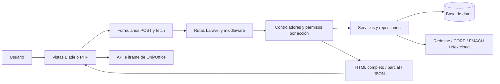

# Auditoría Frontend

Fecha: 10 de septiembre de 2026. Proyecto: NOVA. Alcance: análisis estático del estado del workspace en `/opt/lampp/htdocs/NOVA`, incluida la integración de la interfaz con autenticación, permisos, persistencia y servicios externos.

**Esta auditoría no implementa correcciones.** Los ejemplos son propuestas para una etapa posterior. No se ejecutaron envíos, eliminaciones, migraciones, modificaciones de credenciales ni pruebas contra la base de datos.

## 1. Resumen ejecutivo

Se registran **26 hallazgos: 0 CRÍTICOS, 6 ALTOS, 16 MEDIOS y 4 BAJOS**. De ellos, **23 tienen un defecto o una carencia comprobable por inspección estática** y **3 están clasificados REQUIERE VERIFICACIÓN**: FRONT-005, FRONT-024 y FRONT-026. La severidad de estos tres representa su impacto potencial si se confirma la condición indicada, no una explotación demostrada.

Las prioridades son corregir la serialización de datos dentro de JavaScript, eliminar la interpretación HTML de nombres de usuario, cerrar las excepciones CSRF que alcanzan controladores nativos y resolver los manejadores duplicados de acciones masivas del dashboard de Mantención. Un manejador adicional envía la eliminación sin esperar el modal de confirmación.

Hay protecciones que deben conservarse: escape Blade/`htmlspecialchars` en numerosas salidas, mensajes compartidos con `textContent`, cambio de contraseña ligado al usuario de sesión y a la contraseña actual, throttling de autenticación, permisos y alcance de reportes comprobados en TIC, validación CSRF explícita en varias acciones legacy y credenciales personales resueltas por repositorios. La existencia de estas defensas no cubre automáticamente las excepciones identificadas.

El frontend tiene una base compartida útil, pero combina varios mecanismos de inicialización, navegación y formularios. Su mayor riesgo de mantenimiento no es una preferencia de estilo: existen comportamientos repetidos que ya producen efectos incompatibles, como `requestSubmit()` y `submit()` asociados al mismo botón.

**Límites de la conclusión:** no se realizó navegación autenticada, auditoría con lector de pantalla, medición de contraste renderizado, Lighthouse, medición de Core Web Vitals, prueba de carga, validación de la configuración efectiva de Apache/proxy ni consulta de vulnerabilidades publicadas de dependencias. No se certifica ausencia de otros defectos ni conformidad WCAG. Los tamaños indicados son bytes de archivos en disco, no transferencia HTTP comprimida. La revisión de estructura y búsquedas cubrió las superficies frontend identificadas; la inspección detallada se concentró en los flujos descritos en la sección 2.

## 2. Arquitectura analizada

### 2.1 Estructura y tecnologías reales

El árbol actual usa módulos con nombres distintos de algunos ejemplos históricos de `AGENTS.md`. Las ubicaciones runtime se verificaron con `composer.json`, `config/modules.php`, `routes/web.php` y `app/Providers/AppServiceProvider.php:30`.

| Superficie | Archivos principales | Tecnología y responsabilidad |
| --- | --- | --- |
| Inicio, administración, acceso, integraciones y horas consolidadas | `Nova/views/nova/`, `Nova/Controllers/`, `Nova/Repositories/` | Blade, PHP, formularios POST, JS inline y componentes compartidos |
| Redmine TIC | `RedmineTic/views/native.blade.php`, `RedmineTic/views/native-sections/`, `RedmineTic/Controllers/RedmineDashboardController.php` | Layout Blade y secciones; formularios, AJAX, Select2 y gráficos |
| Mantención | `resources/views/redmine-mantencion/`, `RedmineMantencion/views/partials/`, `RedmineMantencion/Controllers/`, `RedmineMantencion/Services/` | Vistas Blade con PHP procedural; puente con helpers legacy; navegación parcial propia |
| EMACH | `Emach/index.php`, `Emach/views/partials/`, `Emach/assets/theme.css` | Pantalla PHP servida por el puente Laravel; consulta de asistencia y renovación de sesión |
| Telegram | `Nova/views/nova/telegram/`, `app/Modulos/Telegram/`, `telegram/` | UI nativa y librería/servicio del bot; `telegram/index.php` y parciales anteriores requieren distinguirse del entrypoint nativo |
| Procedimientos | `resources/views/procedimientos/`, `Procedimientos/Controllers/`, `RedmineMantencion/views/Procedimientos/_nc_browser.php` | Navegador Nextcloud compartido, peticiones AJAX, editor OnlyOffice |
| Monitor de servidores | `resources/views/monitor-servidores/index.blade.php`, `public/assets/server-monitor.js`, `app/Modulos/MonitorServidores/` | Inventario, comprobaciones y actualización periódica de estado |
| Sistema visual | `public/assets/nova-ui.css`, `public/assets/nova-ui.js`, CSS de TIC y `RedmineMantencion/assets/css/` | Estilos globales y por pantalla; menú, modales, toasts, selectores, toggles y CSRF |
| Build declarado | `package.json`, `package-lock.json`, `vite.config.js`, `resources/js/`, `resources/css/`, `public/build/manifest.json` | Vite; su salida no aparece conectada a las vistas activas revisadas |
| Backend transversal | `app/Http/Kernel.php`, middleware, `routes/web.php`, `config/session.php` | Cookies, sesión, CSRF, cabeceras, permisos y transporte de los formularios |

Backend declarado: PHP `^8.2`, Laravel `^12.0`, Guzzle `^7.2` y Sanctum `^4.0`. Frontend: JavaScript nativo, Bootstrap 5.3.3, Bootstrap Icons 1.11.3, jQuery 3.7.1, Select2 4.1.0-rc.0, Chart.js y su plugin local. OnlyOffice carga su API desde la URL configurada. No se encontró una aplicación React/Vue como frontend principal.

Versiones registradas en `package-lock.json`: Vite 4.5.14, laravel-vite-plugin 0.7.8, Axios 1.18.1, Lodash 4.18.1 y PostCSS 8.5.15. Son datos del lockfile; no implican que esos paquetes estén cargados en cada pantalla ni que estén libres de vulnerabilidades. No se atribuyen CVE sin una verificación específica.

Se inventariaron 60 plantillas PHP/Blade en los directorios de vistas, con 24.435 líneas, además de los entrypoints PHP que contienen UI. Se recorrieron también `app`, `bootstrap`, `config`, `database`, `routes`, `tests`, `docs`, `scripts`, `ops` y los directorios auxiliares/legacy. `vendor`, `node_modules`, almacenamiento runtime, documentos subidos y el árbol `redmine-20260725-221707` no se trataron como código frontend propio. Se consultaron puntualmente dos implementaciones de Laravel para comprobar `@json` y `withInput`.

### 2.2 Comunicación con backend



La autenticación usa sesión NOVA; no es correcto asumir que el middleware `auth` de Laravel, por sí solo, modela este acceso. El grupo `nova.auth` protege las pantallas. Los formularios conviven con respuestas redirect y JSON. Mantención excluye rutas de la comprobación CSRF de Laravel para validar con helpers, mientras TIC usa CSRF nativo. Esta diferencia explica FRONT-003.

Los permisos se comprobaron en ambos extremos: en TIC, `dashboardAction()` autoriza acciones y filtra IDs por alcance antes de editar, eliminar o enviar (`RedmineTic/Controllers/RedmineDashboardController.php:208–230`). En Mantención, `RedmineMantencion/Services/MantencionDashboardService.php:83–89` define permisos por acción y los verifica en `handle_request()`. Ocultar botones y bloquear reportes procesados en JS es una ayuda de interacción, no una frontera de autorización.

### 2.3 Método y comprobaciones realizadas

- Inventario, búsquedas transversales y seguimiento manual de fuentes de datos, sinks DOM, formularios, rutas y métodos de persistencia.
- Lectura de dependencias, configuración de plantillas, recursos incluidos, caché por `filemtime` y pruebas frontend existentes.
- `node --check` sobre `nova-ui.js`, `server-monitor.js`, `redmine-tic-quick-report.js` y `nova-sidebar-preload.js`: sin errores de sintaxis. Esto no valida ejecución DOM ni scripts embebidos en plantillas.
- Prueba aislada de serialización PHP y parsing HTML, sin servidor ni archivos: una cadena sintética con `</script>` produce un elemento HTML fuera del script con las opciones usadas en FRONT-001.
- Ejecución aislada en memoria del bloque `submitBulk` de Mantención, con un formulario simulado: un clic en el listener de eliminar produce `nativeSubmits=1`, `action=delete_selected`, sin pedir confirmación. No se borró ningún reporte.
- No se ejecutó PHPUnit/artisan ni build: pueden escribir caché, sesiones, logs o datos y esta etapa exige no modificar el proyecto.

## 3. Hallazgos críticos

**No se identificaron hallazgos de severidad CRÍTICO demostrados en el alcance revisado.** No se demostró compromiso general de infraestructura ni acceso remoto no autenticado a secretos. FRONT-024 exige verificar la exposición HTTP real antes de concluir que existe divulgación de credenciales.

## 4. Hallazgos de seguridad

| ID | Severidad | Resultado |
| --- | --- | --- |
| FRONT-001 | ALTO | Datos sin escape adecuado dentro de scripts: histórico Mantención y configuración del editor |
| FRONT-002 | ALTO | Nombres de usuario interpretados como HTML en el selector de permisos |
| FRONT-003 | ALTO | Rutas nativas de integraciones cubiertas por exclusiones CSRF legacy |
| FRONT-005 | ALTO | REQUIERE VERIFICACIÓN: alcance de edición de horas frente al filtrado personal |
| FRONT-006 | MEDIO | Secretos reenviados completos a la sesión mediante `withInput()` |
| FRONT-007 | MEDIO | Renovación de CSRF incompleta entre componentes de una página |
| FRONT-009 | MEDIO | No se emite CSP desde la aplicación |
| FRONT-010 | MEDIO | Scripts externos sin verificación de integridad |
| FRONT-024 | ALTO | REQUIERE VERIFICACIÓN: artefactos sensibles fuera de `public` y exposición por DocumentRoot |

No se encontró almacenamiento de contraseñas/API keys en `localStorage` o `sessionStorage` en las superficies analizadas. Los usos revisados guardan preferencias de sidebar, filtros y desbloqueo visual de acciones. Los tokens CSRF en el DOM son necesarios para los formularios y no se clasifican, por sí solos, como filtración. El JWT/config de OnlyOffice es un dato necesario para su integración; el defecto señalado es su serialización, no su mera presencia.

## 5. Hallazgos de rendimiento

Los problemas con evidencia son sondeo sin exclusión de concurrencia (FRONT-012), tablas con conjuntos completos y metadatos por fila (FRONT-013), carga de CSS global extensa (FRONT-014), ejecución duplicada de jQuery/Select2 (FRONT-015) y riesgos de acumulación de inicializadores que requieren verificación de ciclo de vida (FRONT-026).

Tamaños en disco: `nova-ui.css`, 346.928 bytes; `nova-ui.js`, 62.720 bytes; `redmine-tic-native.css`, 47.719 bytes; `RedmineMantencion/assets/theme.css`, 51.697 bytes. El GIF CORE `animacion-carga.gif` ocupa 1.109.176 bytes; cada copia de `redmine.gif`, 732.959 bytes. La existencia de varias referencias al mismo URL no se cuenta como varias descargas: el navegador puede reutilizar caché. `Nextcloud.gif` ocupa 4.919.821 bytes, pero no se confirmó una referencia activa y no se le atribuye un coste de carga de página.

No se midieron tiempos de red, CPU, memoria o Web Vitals. La magnitud del deterioro con datos reales requiere medición; las causas estructurales descritas son observables en código.

## 6. Hallazgos de mantenibilidad

FRONT-004 muestra un conflicto funcional real entre implementaciones repetidas. FRONT-014 describe una cascada con varias redefiniciones globales y 997 apariciones de `!important`. FRONT-016 recoge concentración de HTML, reglas y JS en plantillas grandes. FRONT-017/026 describen las responsabilidades asumidas por la navegación parcial. FRONT-023 señala la desconexión entre build documentado y carga real. FRONT-025 distingue las pruebas de texto de las pruebas de comportamiento.

No se recomienda cambiar de framework, reescribir todos los módulos ni eliminar cada `!important`. Tampoco se declaran muertos los directorios legacy únicamente por su nombre: varios se reutilizan activamente desde controladores nativos.

## 7. UX y accesibilidad

Los errores de uso prioritarios son la eliminación sin confirmación (FRONT-004), bloqueo del modal de contraseña ante una petición pendiente (FRONT-011), pérdida de guardado por token obsoleto (FRONT-007), rechazo de contraseñas válidas con espacios (FRONT-008), estado aparentemente fresco del monitor ante fallos (FRONT-012) y falsos éxitos en Nextcloud (FRONT-018).

Se observaron controles sin asociación de etiqueta (FRONT-020), tarjetas de carpetas activables solo con ratón aunque tengan `role=button` (FRONT-019) y un selector custom con estado ARIA incompleto (FRONT-021). Hay elementos positivos: idioma `es`, viewport, botones con nombre accesible en numerosas acciones, modales Bootstrap, `<dialog>` para contraseña, tablas en contenedores de scroll, estilos de foco y media queries de movimiento reducido.

**Responsive y contraste: REQUIEREN VERIFICACIÓN visual.** Existen reglas de adaptación y no hay evidencia suficiente para afirmar un desbordamiento concreto o una relación de contraste incumplida en una pantalla renderizada. Se recomienda probar 320/375/768/1280 px, zoom 200 %, teclado y lector de pantalla, sin registrar como defecto cualquier sospecha no medida.

## 8. Detalle completo de hallazgos

### FRONT-001 — Serialización insegura dentro de bloques script

- **Severidad:** ALTO. **Estado:** CONFIRMADO por flujo de datos y prueba aislada de parsing.
- **Archivos y ubicación:** `RedmineMantencion/Controllers/HistoricoController.php:88`; `resources/views/redmine-mantencion/historico.blade.php:532`; adicionalmente `resources/views/procedimientos/editor.blade.php:21` y `Procedimientos/Controllers/ProcedimientosController.php:85–87`.
- **Problema:** JSON válido no equivale a contenido seguro dentro de un elemento `<script>`. Se permite conservar `</script>` literal.
- **Evidencia:** `$_GET['estado_redmine']` se copia a `$f_estado_redmine` y después a `const activeRedmineStatusFilter` con `JSON_UNESCAPED_SLASHES`, sin `JSON_HEX_TAG`. El editor usa `@json($editorConfig, JSON_UNESCAPED_SLASHES)` e incluye el nombre del usuario. `vendor/laravel/framework/src/Illuminate/View/Compilers/Concerns/CompilesJson.php:24` muestra que las opciones explícitas reemplazan las seguras predeterminadas.
- **Riesgo/impacto:** inyección de HTML y JavaScript en el origen NOVA, con la sesión del visitante. No basta que el filtro se compare después con estados válidos.
- **Escenario:** un usuario autorizado para Histórico abre una URL cuyo `estado_redmine` contiene una terminación de script y un nuevo elemento activo. En el editor, un nombre almacenado con contenido equivalente llega al mismo contexto.
- **Solución recomendada:** serializar con `Illuminate\Support\Js::from`; no concatenar cadenas sin codificación del contexto. Conservar las validaciones de permisos existentes.

```blade
const activeRedmineStatusFilter = {{ \Illuminate\Support\Js::from($f_estado_redmine) }};
const config = {{ \Illuminate\Support\Js::from($editorConfig) }};
```

La prueba aislada utilizó un marcador sintético y un parser en memoria; no se intentó explotar una sesión real.

### FRONT-002 — XSS almacenado posible desde nombres en el selector de permisos

- **Severidad:** ALTO. **Estado:** CONFIRMADO: fuente y sink sin escape; no se insertó un usuario malicioso.
- **Archivos y ubicación:** `resources/views/redmine-mantencion/configuracion.blade.php:643–646`, `:1306–1311`, `:1336–1340`; `RedmineMantencion/Controllers/ConfiguracionController.php:73–89`; `Nova/Repositories/NovaUserRepository.php:105–107`.
- **Problema:** los nombres centrales se serializan a objetos JS y luego se interpolan directamente en `btn.innerHTML`.
- **Evidencia:** `user.label` contiene nombre, apellido e ID; el sink usa `<span>${user.label}</span>`. La entrada de identidad revisada exige datos no vacíos, pero no impide caracteres de marcado. `json_encode` protege la sintaxis JS, no esta segunda interpretación HTML.
- **Riesgo/impacto:** ejecución en la sesión del administrador que busca usuarios o modifica permisos. Se requiere que contenido no confiable alcance el nombre/importación; no se afirma que cualquier usuario pueda editar su identidad.
- **Escenario:** una identidad importada o creada con marcado de imagen/evento aparece entre los resultados de búsqueda.
- **Solución recomendada:** construir nodos y asignar texto; no intentar resolverlo únicamente prohibiendo nombres en el backend.

```js
const label = document.createElement('span');
label.textContent = user.label;
const identity = document.createElement('span');
identity.className = 'user-picker-id';
identity.textContent = `ID ${user.id}`;
btn.replaceChildren(label, identity);
```

### FRONT-003 — Formularios de integraciones sin validación CSRF efectiva

- **Severidad:** ALTO. **Estado:** CONFIRMADO por rutas y cadena de middleware/controlador.
- **Archivos y ubicación:** `app/Http/Middleware/VerifyCsrfToken.php:20–32`; `config/modules.php`, entradas de EMACH y Mantención; `routes/web.php:125` y `:174`; `Nova/Controllers/UserIntegrationController.php:177–250`, `:346–369`.
- **Problema:** las excepciones por prefijo destinadas a legacy incluyen endpoints nativos que no llaman a un validador CSRF equivalente.
- **Evidencia:** EMACH es `legacy`; Mantención declara `legacy_csrf_validation=true`. Ambos prefijos retornan `true` en `inExceptArray()`. `update()` puede guardar o eliminar credenciales y no comprueba token; `authorizeModule()` comprueba acceso pero tampoco CSRF. Incluir `auth.php` solo define `csrf_validate()`, no la ejecuta.
- **Riesgo/impacto:** una petición con cookies válidas puede reemplazar o eliminar la integración propia sin demostrar que procede de un formulario legítimo.
- **Escenario:** POST forjado en un contexto con cookies, por ejemplo desde otro origen del mismo sitio. `SameSite=Lax` reduce algunos ataques desde sitios externos; no sustituye la protección CSRF ni cubre todos los escenarios same-site.
- **Solución recomendada:** excluir de la excepción únicamente los endpoints legacy que efectivamente validan el token; permitir que los endpoints nativos usen el middleware de Laravel. Verificar rechazo 419 al omitir o alterar `_token` en guardar y eliminar. No basta conservar el hidden input.

### FRONT-004 — Acciones masivas duplicadas y eliminación sin confirmación

- **Severidad:** ALTO. **Estado:** CONFIRMADO, incluida ejecución aislada del listener adicional.
- **Archivo y ubicación:** `resources/views/redmine-mantencion/dashboard.blade.php:1474–1513`, `:1799–1843` y `:2243–2261`.
- **Problema:** dos bloques conectan los mismos botones. Uno usa `requestSubmit()` y un modal de confirmación; el otro llama directamente a `processForm.submit()`.
- **Evidencia:** el primer listener de eliminar abre `deleteSelectedModal`; el de la línea 2261 llama `submitBulk('delete_selected')`, cuyo `submit()` no dispara el evento `submit`. La prueba aislada del segundo bloque produjo un envío nativo inmediato.
- **Riesgo/impacto:** eliminación de reportes sin la confirmación prometida; solicitudes concurrentes o navegación mientras continúa una operación AJAX; estados de carga omitidos.
- **Escenario:** seleccionar reportes y pulsar Eliminar. Para Enviar/Archivar, ambos listeners pueden iniciar rutas diferentes; la entrega exacta de dos peticiones depende del navegador y debe medirse, pero el registro doble está demostrado.
- **Solución recomendada:** un único manejador por acción; confirmar primero, después un solo `requestSubmit()` o una sola función AJAX; bloqueo de reentrada. Mantener permiso, alcance y CSRF en backend. Añadir idempotencia cuando se creen tickets externos.

### FRONT-005 — Alcance personal de lectura frente a edición de horas por fecha

- **Severidad:** ALTO. **Estado:** REQUIERE VERIFICACIÓN de la política de autorización.
- **Archivos y ubicación:** `RedmineMantencion/Controllers/HorasExtraController.php:53–76`; `RedmineMantencion/Services/MantencionHorasExtraService.php:115–130`, `:154–164`; `RedmineMantencion/Repositories/MantencionHoursExtraRepository.php:182–199`; `Nova/Repositories/HorasExtraRepository.php:204–239`. También `Nova/Controllers/HoursExtraController.php:29–72`.
- **Problema:** la lectura se filtra por usuario, pero la escritura recibe origen/fecha, sin identificar al propietario visible.
- **Evidencia:** `filterGroupsForUser()` limita los reportes; `updateGroupsByOrigenAndFecha()` busca grupos por origen y fecha y actualiza todos. El propio comentario documenta esa propagación como comportamiento heredado. La pantalla central verifica acceso al módulo antes de editar, sin comprobar aquí `horas_extra_editar` del módulo propietario.
- **Riesgo/impacto potencial:** cambiar horarios de otros usuarios o permitir edición a un usuario que solo debería consultar. No se declara una vulnerabilidad confirmada porque la actualización global por fecha puede ser una política de negocio intencional.
- **Escenario a comprobar:** dos usuarios con horas el mismo día y permisos distintos; editar desde la vista personal o cambiar `fecha` en el POST.
- **Solución recomendada:** aclarar y probar la política. Si es personal, pasar y autorizar el grupo/usuario antes de escribir. Si es global, exigir un permiso global explícito y mostrar el alcance de la actualización en la interfaz.

### FRONT-006 — Secretos incluidos en old input de sesión

- **Severidad:** MEDIO. **Estado:** CONFIRMADO por API de Laravel.
- **Archivos y ubicación:** `Nova/Controllers/UserIntegrationController.php:217–223`; `vendor/laravel/framework/src/Illuminate/Http/RedirectResponse.php:75–79`; `config/session.php:49`.
- **Problema:** algunos errores de formulario usan `withInput()` sin limitar campos y pueden almacenar `secret` completo en sesión.
- **Evidencia:** al faltar `external_user`, el controlador devuelve `withInput()` aunque se haya recibido un secreto. La implementación de Laravel copia los inputs retirando archivos, sin aplicar el `$dontFlash` del manejador de excepciones. La configuración de sesión declara `encrypt=false`.
- **Riesgo/impacto:** persistencia adicional e innecesaria de contraseñas o API keys fuera de su repositorio de secretos. No se observó que las vistas las vuelvan a mostrar ni se inspeccionaron sesiones reales.
- **Escenario:** ingresar un secreto y enviar dejando vacío un usuario externo obligatorio.
- **Solución recomendada:** conservar únicamente inputs no sensibles, por ejemplo `withInput($request->only(['type', 'external_user']))`. Aplicar la misma política a todos los retornos de validación manual.

### FRONT-007 — Tokens CSRF capturados que no siguen la renovación de sesión

- **Severidad:** MEDIO. **Estado:** CONFIRMADO en el flujo estático.
- **Archivos y ubicación:** `public/assets/redmine-tic-quick-report.js:8`, `:59`, `:98`; `public/assets/nova-ui.js:639–645`, `:1359–1380`; `Nova/views/nova/partials/session-control.blade.php:55–70`, `:146`; `Emach/views/partials/navbar.php:102`, `:192–196`.
- **Problema:** varios consumidores conservan una copia del token inicial. El cambio de contraseña actualiza meta/inputs, pero no esas variables ni llama al mecanismo global de actualización.
- **Evidencia:** el guardado de notas usa `const csrfToken`; su beacon también. `updatePassword()` regenera sesión (`Nova/Controllers/NovaAuthController.php:94`), que rota el token; el modal escribe algunos campos directamente. El logout del modal usa su variable local y `form.submit()`, que omite el listener global de submit.
- **Riesgo/impacto:** respuestas 419, notas que dejan de guardarse o un cierre de sesión fallido después de cambiar contraseña/renovar sesión sin recargar.
- **Escenario:** cambiar la contraseña desde Reporte rápido y continuar escribiendo notas; posteriormente cerrar sesión mediante el modal de sesión.
- **Solución recomendada:** leer el token vigente al enviar o centralizar suscripciones a `nova:csrf-token-updated`; usar `NovaCsrfForms.setToken()` en todos los caminos de rotación y evitar copias constantes para operaciones futuras.

### FRONT-008 — Renovación de sesión altera contraseñas válidas

- **Severidad:** MEDIO. **Estado:** CONFIRMADO.
- **Archivos y ubicación:** `Nova/views/nova/partials/session-control.blade.php:153`; `RedmineMantencion/views/partials/navbar.php:729`; `app/Http/Middleware/TrimStrings.php:14–19`; `Nova/Controllers/NovaAuthController.php:70–88`.
- **Problema:** el JS de renovación aplica `.trim()` a la contraseña, aunque el login/cambio de contraseña preserva sus espacios.
- **Evidencia:** `password` y `current_password` están excluidos del recorte del middleware. El formulario de cambio puede guardar una contraseña con espacios al principio o al final; el modal envía otro valor al renovarla.
- **Riesgo/impacto:** un usuario con contraseña válida recibe rechazo y puede agotar el límite de intentos.
- **Escenario:** crear una contraseña que comience o termine con espacio, iniciar sesión y usar Continuar sesión.
- **Solución recomendada:** validar presencia sin modificar el valor: `const password = passwordInput?.value ?? ''; if (password === '') ...`.

### FRONT-009 — CSP ausente en la capa de aplicación

- **Severidad:** MEDIO. **Estado:** CONFIRMADO en código; la cabecera efectiva del proxy no se verificó.
- **Archivo y ubicación:** `app/Http/Middleware/SecurityHeaders.php:12–18` y `app/Http/Kernel.php`.
- **Problema:** las cabeceras implementadas no incluyen `Content-Security-Policy`.
- **Evidencia:** se emiten `nosniff`, `SAMEORIGIN`, Referrer/Permissions Policy y política cross-domain, pero no CSP. Hay scripts inline y scripts de terceros.
- **Riesgo/impacto:** falta una defensa adicional frente a inyección y carga de recursos no previstos. No es por sí sola una prueba de XSS ni reemplaza FRONT-001/002.
- **Escenario:** una inyección llega a un atributo de evento o a un script y no existe una política efectiva que limite su ejecución.
- **Solución recomendada:** inventariar orígenes y empezar con CSP Report-Only; migrar a nonces/hashes y directivas ajustadas a OnlyOffice/Nextcloud. No introducir una política bloqueante sin validar los módulos.

### FRONT-010 — Scripts de CDN sin SRI

- **Severidad:** MEDIO. **Estado:** CONFIRMADO.
- **Archivos y ubicación:** `RedmineMantencion/views/partials/bootstrap-scripts.php:23–25`; `Nova/views/nova/home.blade.php:241`; `resources/views/procedimientos/index.blade.php:57`; layout TIC y otras vistas con los mismos CDN.
- **Problema:** scripts ejecutables externos se cargan sin atributo `integrity`.
- **Evidencia:** Bootstrap, jQuery y Select2 tienen versiones fijadas en URL, pero no verificación SRI. No se ha encontrado ni demostrado compromiso de esos recursos.
- **Riesgo/impacto:** alteración de un recurso suministrado por CDN ejecutaría código en NOVA; una caída de CDN afecta funciones básicas de modales/selectores.
- **Escenario:** recurso externo alterado o inaccesible en una red institucional restringida.
- **Solución recomendada:** distribuir copias verificadas en el despliegue o usar SRI y `crossorigin` con hashes del artefacto exacto. Documentar la estrategia de dependencia externa; no añadir un fallback que cargue código sin verificar.

### FRONT-011 — Modal de contraseña puede quedar bloqueado por una petición pendiente

- **Severidad:** MEDIO. **Estado:** CONFIRMADO como ausencia de límite y de salida durante guardado.
- **Archivo y ubicación:** `public/assets/nova-ui.js:558–573`, `:614–630`, `:657–660`.
- **Problema:** al guardar se desactiva cerrar y se cancela Escape; el `fetch` no tiene plazo máximo.
- **Evidencia:** `AbortController` solo se aborta al cerrar el diálogo, pero cerrar está impedido mientras `saving=true`. `finally` no se ejecutará hasta que la promesa termine.
- **Riesgo/impacto:** un proxy o backend que no complete la respuesta mantiene un diálogo modal sin salida funcional.
- **Escenario:** conectividad degradada durante Guardar contraseña. El timeout de conexión a Redmine no protege este endpoint.
- **Solución recomendada:** plazo explícito, recuperación de controles y aviso de resultado incierto si el servidor pudo aplicar el cambio. Cancelar la espera del navegador no debe presentarse como cancelación de la operación del servidor.

### FRONT-012 — Sondeo del monitor puede solaparse y mostrar datos obsoletos sin aviso

- **Severidad:** MEDIO. **Estado:** CONFIRMADO.
- **Archivo y ubicación:** `public/assets/server-monitor.js:388–443`, `:455–457`.
- **Problema:** un intervalo fijo inicia `refreshDashboard()` sin comprobar si la consulta anterior terminó; los errores se descartan sin marcar obsolescencia.
- **Evidencia:** `setInterval(..., 15000)` y `fetch` sin timeout/cancelación/exclusión. HTTP no exitoso retorna silenciosamente; el catch está vacío a efectos de interfaz.
- **Riesgo/impacto:** acumulación de peticiones, una respuesta anterior que sobrescribe otra más nueva y percepción de que el estado sigue actualizándose.
- **Escenario:** `/estado` tarda más de 15 segundos o falla durante varios ciclos.
- **Solución recomendada:** programar la siguiente consulta después de terminar la anterior, limitar espera, descartar respuestas antiguas, pausar en pestaña oculta y mostrar última actualización/estado de sincronización. Medir el coste antes de ajustar frecuencia.

### FRONT-013 — Dashboards sin paginación de servidor

- **Severidad:** MEDIO. **Estado:** CONFIRMADO estructuralmente; el umbral de degradación requiere medición.
- **Archivos y ubicación:** `RedmineTic/Repositories/RedmineDataRepository.php:244–251`; `RedmineTic/views/native-sections/dashboard.blade.php:191–312`; `resources/views/redmine-mantencion/dashboard.blade.php:246` y `:1476–1483`; `RedmineMantencion/Services/MantencionDashboardService.php:734`.
- **Problema:** se obtienen y renderizan conjuntos completos de reportes accesibles, con filtrado/selección en el DOM y datos de detalle incorporados a filas.
- **Evidencia:** `activeReports()` seguido de filtros en memoria y `@forelse ($reports...)`; Mantención itera `$messages` completo. Las búsquedas de selección recorren `.msg-check` repetidamente.
- **Riesgo/impacto:** crecimiento del HTML, coste de layout, memoria y respuesta de filtros cuando aumenta el backlog. No se atribuye el coste de todo el conjunto a usuarios cuyo alcance lo limita.
- **Escenario:** cientos o miles de reportes visibles para un administrador.
- **Solución recomendada:** paginación y filtros desde backend, conteos por consulta y carga de detalle bajo demanda. Definir explícitamente si Seleccionar todos abarca página, filtro o todo el conjunto antes de cambiar el comportamiento.

### FRONT-014 — CSS global extenso y cascada de redefiniciones

- **Severidad:** MEDIO. **Estado:** CONFIRMADO.
- **Archivo y ubicación:** `public/assets/nova-ui.css`, 15.779 líneas/346.928 bytes; `:1314–1324`, `:1862–1865`, `:5287–5288`, `:12007–12012`. Inclusión global, por ejemplo `Nova/views/nova/home.blade.php:11`.
- **Problema:** el archivo común incluye reglas de muchas pantallas y redefiniciones de los mismos componentes; 997 apariciones de `!important` dificultan determinar la regla autoritativa.
- **Evidencia:** `.modal-content` recibe borde, radio y sombra en varias capas, con declaraciones importantes que reemplazan las anteriores. El mismo CSS se carga incluso en inicio y login.
- **Riesgo/impacto:** coste de descarga/parsing inicial y cambios transversales difíciles de aislar. No toda repetición o `!important` es incorrecta; aquí existe competencia observable entre declaraciones del mismo componente.
- **Escenario:** modificar un modal en la primera capa sin advertir que una regla posterior domina su estilo.
- **Solución recomendada:** definir la propiedad de cada componente, consolidar reglas con comparación visual y separar estilos exclusivos por módulo/pantalla. Conservar tokens compartidos y medir cobertura antes de retirar reglas.

### FRONT-015 — jQuery y Select2 se ejecutan dos veces en usuarios Nextcloud

- **Severidad:** MEDIO. **Estado:** CONFIRMADO por composición de plantilla.
- **Archivos y ubicación:** `resources/views/redmine-mantencion/integraciones-nextcloud-usuarios.blade.php:430–432`; `RedmineMantencion/views/partials/bootstrap-scripts.php:23–24`.
- **Problema:** después de incluir el parcial que carga ambas librerías, la vista vuelve a incluirlas.
- **Evidencia:** los cuatro tags usan las mismas URLs de jQuery/Select2. La caché puede evitar repetir transferencia, pero no evita que dos tags ejecuten otra vez el código.
- **Riesgo/impacto:** trabajo duplicado y sustitución de la instancia global jQuery, con posible pérdida de plugins/datos vinculados a la anterior.
- **Escenario:** carga completa de la página de usuarios Nextcloud; coexistencia con inicializadores del layout.
- **Solución recomendada:** cargar una sola vez las dependencias en el layout y declarar únicamente código de la página. Comprobar apertura/cierre de Select2 tras el cambio.

### FRONT-016 — Plantillas concentran estructura, datos y control de interacción

- **Severidad:** MEDIO. **Estado:** CONFIRMADO como deuda con impacto observable.
- **Archivos y ubicación:** `RedmineTic/views/native-sections/config.blade.php` (2.432 líneas); `Nova/views/nova/admin/index.blade.php` (1.573); `resources/views/redmine-mantencion/dashboard.blade.php` (2.272); `resources/views/redmine-mantencion/configuracion.blade.php:627–652`, `:1306–1356`.
- **Problema:** pantallas grandes mezclan preparación de catálogos, permisos, múltiples formularios y controladores JS. Cambios de una sección exigen revisar bloques distantes y variantes de estado.
- **Evidencia:** Configuración de Mantención vuelve a construir `$usersList` en la vista y más de 600 líneas después lo transforma en otro selector JS. Dashboard contiene dos implementaciones de acciones, ya demostradas en FRONT-004.
- **Riesgo/impacto:** regresiones por reglas o listeners añadidos sin detectar otro bloque existente; pruebas de comportamiento más difíciles de aislar.
- **Escenario:** modificar la selección masiva, una integración o un permiso y afectar otra sección de la misma plantilla.
- **Solución recomendada:** extraer por responsabilidad demostrada: datos de presentación en controlador/view model, parcial de formulario y módulo JS con `init/destroy`. No es necesaria una reescritura SPA ni una división arbitraria por número de líneas.

### FRONT-017 — Navegación parcial pierde semántica de navegación y estado

- **Severidad:** MEDIO. **Estado:** CONFIRMADO en manejo de eventos.
- **Archivo y ubicación:** `RedmineMantencion/views/partials/navbar.php:495–498`, `:516`, `:547–570`.
- **Problema:** se interceptan clics sin respetar Ctrl/Cmd/Shift; una navegación pendiente descarta nuevas navegaciones y también `popstate`.
- **Evidencia:** `handleClick()` solo excluye `_blank` y otros orígenes. `_loadPageBusy` provoca un retorno inmediato, no una cola ni cancelación. Se actualiza URL/contenido sin mover el foco al nuevo contenido ni anunciarlo.
- **Riesgo/impacto:** Ctrl/Cmd+clic no abre la pestaña esperada; Atrás durante una carga puede dejar URL y contenido desalineados; usuario de teclado permanece en el enlace anterior.
- **Escenario:** cambiar de sección con red lenta y pulsar Atrás o abrir una sección con tecla modificadora.
- **Solución recomendada:** respetar navegación modificada, gestionar solicitudes por identificador/abort, sincronizar historial y foco. Confirmar navegación cuando haya cambios sin guardar.

### FRONT-018 — Nextcloud puede interpretar una página HTML como operación exitosa

- **Severidad:** MEDIO. **Estado:** CONFIRMADO en contrato de respuesta.
- **Archivo y ubicación:** `RedmineMantencion/views/Procedimientos/_nc_browser.php:468–489`, `:822–835`.
- **Problema:** `apiFetch()` devuelve `{ok: resp.ok, _raw: true}` si la respuesta no es JSON; algunos handlers aceptan cualquier `ok=true` como éxito.
- **Evidencia:** fetch sigue redirecciones por defecto. Una página de login HTML con estado 200 se convierte en éxito; Crear carpeta muestra el mensaje de creación. Además, varios handlers esperan `apiFetch` sin catch, aunque `finally` solo oculta el overlay y no maneja la excepción.
- **Riesgo/impacto:** confirmación falsa de operaciones y falta de feedback ante errores de red/parsing.
- **Escenario:** sesión vencida que redirige al login durante mkdir, o caída de red al renombrar.
- **Solución recomendada:** validar estado, redirección, content type y estructura JSON; tratar autenticación caducada de forma explícita; capturar errores en una capa común y no mostrar éxito sin confirmación de la operación.

### FRONT-019 — Carpetas Nextcloud enfocables pero no activables con teclado

- **Severidad:** MEDIO. **Estado:** CONFIRMADO.
- **Archivo y ubicación:** `RedmineMantencion/views/Procedimientos/_nc_browser.php:571–604`.
- **Problema:** una tarjeta es `div`, tiene `tabIndex=0` y `role=button`, pero su apertura solo escucha `click`.
- **Evidencia:** no se registra Enter/Espacio para la tarjeta; los `keydown` existentes corresponden a campos de otros modales. Asignar role no añade el comportamiento de un botón nativo. La tarjeta contiene además botones de acciones.
- **Riesgo/impacto:** el usuario puede enfocar una carpeta pero no entrar en ella usando solo teclado.
- **Escenario:** Tab hasta una carpeta y pulsar Enter/Espacio.
- **Solución recomendada:** enlace/botón principal nativo para abrir y botones de acciones como hermanos, sin controles interactivos anidados. Si se conserva una estructura custom, implementar teclado y semántica completa.

### FRONT-020 — Etiquetas visuales sin asociación con inputs

- **Severidad:** MEDIO. **Estado:** CONFIRMADO en ejemplos representativos.
- **Archivos y ubicación:** `RedmineTic/views/native-sections/dashboard.blade.php:394–428`; `resources/views/redmine-mantencion/dashboard.blade.php:727–738`; `resources/views/redmine-mantencion/pendientes-manual.blade.php:72–91`, `:163–167`.
- **Problema:** labels sin `for` junto a controles sin ID, o textos en `div.field-label` que no constituyen un nombre accesible.
- **Evidencia:** Tiempo estimado del dashboard de TIC usa label hermano e input sin ID; Hora extra de Pendiente Manual usa un div. El inventario detecta 157 aperturas `<label>` sin `for`; es una métrica orientativa, no 157 fallos, pues un label envolvente sí puede ser válido.
- **Riesgo/impacto:** lectores de pantalla no reciben un nombre fiable y hacer clic en la etiqueta no enfoca el campo.
- **Escenario:** completar formularios de edición o pendientes solo con tecnologías de asistencia.
- **Solución recomendada:** ID único y `<label for=...>`; asociar instrucciones y errores con `aria-describedby`, `aria-invalid` cuando corresponda. Comprobar también la asociación del widget Select2 generado.

### FRONT-021 — Estado accesible incompleto en el selector de búsqueda global

- **Severidad:** BAJO. **Estado:** CONFIRMADO.
- **Archivos y ubicación:** `Nova/views/nova/admin/index.blade.php:1007–1010`; `public/assets/nova-ui.js:882–890`, `:910–954`.
- **Problema:** se implementa navegación visual de opciones, pero la selección activa se refleja solo en una clase CSS.
- **Evidencia:** menú `role=listbox` y botones `role=option`; input sin relación `aria-controls`/`aria-activedescendant` ni actualización de `aria-expanded`; `setActive()` solo cambia `.is-active` y scroll.
- **Riesgo/impacto:** una persona que usa lector de pantalla puede no conocer el resultado activo pese a usar flechas.
- **Escenario:** seleccionar a un usuario en Administración sin ver la lista.
- **Solución recomendada:** completar un patrón combobox coherente, con IDs de opción, estado expandido y opción activa/seleccionada anunciados; verificar que Enter confirma el mismo valor mostrado.

### FRONT-022 — Porcentajes y etapas de integración calculados por tiempo

- **Severidad:** BAJO. **Estado:** CONFIRMADO.
- **Archivo y ubicación:** `resources/views/redmine-mantencion/dashboard.blade.php:1934–1945`, `:1978–1992`.
- **Problema:** la barra anuncia etapas de backend y porcentajes que no provienen del servidor.
- **Evidencia:** un `setInterval` avanza entre frases como Guardando y Confirmando, con tope 94 %, independientemente de la respuesta de CORE/Redmine.
- **Riesgo/impacto:** falsa percepción de avance; dificulta distinguir espera, caída o operación que todavía no empezó. No implica por sí mismo corrupción de datos.
- **Escenario:** CORE sigue autenticando mientras el texto ya anuncia procesamiento/guardado.
- **Solución recomendada:** indicador indeterminado con tiempo transcurrido y mensajes verificables; usar porcentajes únicamente con un contador real de trabajo completado.

### FRONT-023 — Build declarado desconectado de las vistas activas

- **Severidad:** BAJO. **Estado:** CONFIRMADO dentro de las referencias del repositorio revisadas.
- **Archivos y ubicación:** `vite.config.js:6–10`; `resources/js/app.js`; `resources/js/bootstrap.js`; `resources/css/app.css`; `public/build/manifest.json`; `README.md:100–106`; `Nova/views/welcome.blade.php`.
- **Problema:** `npm run dev/build` trabaja sobre entradas que no se incluyen en las plantillas activas; el frontend real carga scripts y CSS desde `public/assets` y CDN.
- **Evidencia:** no se encontraron `@vite` ni referencias a `build/assets` en las vistas activas; `app.css` está vacío y el JS de entrada carga Axios/Lodash. La vista welcome no aparece enlazada a rutas/controladores revisados.
- **Riesgo/impacto:** un desarrollador cambia el bundle o una dependencia creyendo modificar la UI y no observa efecto; confusión entre dependencias de build y runtime.
- **Escenario:** introducir un ajuste de Axios o estilo en `resources` y desplegar únicamente el build.
- **Solución recomendada:** documentar la cadena real y decidir si integrar esos entrypoints o retirar el scaffolding en una etapa autorizada. No eliminar paquetes por aparente falta de uso sin revisar scripts y herramientas de desarrollo.

### FRONT-024 — Posible exposición HTTP de artefactos sensibles en la raíz

- **Severidad:** ALTO. **Estado:** REQUIERE VERIFICACIÓN del despliegue efectivo.
- **Archivos y ubicación:** `.htaccess:1`; `public/.htaccess`, bloque `FilesMatch`; `env.txt`; `bd.txt`.
- **Problema:** hay copias de configuración y datos fuera de `public`; la protección observada depende de que el servidor publique exclusivamente `public`.
- **Evidencia:** `.htaccess` de raíz solo declara `DirectoryIndex`. Un escaneo local sin imprimir valores confirmó asignaciones de entorno y alguna asignación no vacía de credencial/clave en `env.txt`, y sintaxis de dump SQL en `bd.txt`. La protección dentro de `public/.htaccess` no protege archivos hermanos del directorio. No se comprobó si los valores son vigentes ni si estas URLs son accesibles.
- **Riesgo/impacto potencial:** divulgación de configuración, claves o datos si el DocumentRoot/alias permite servir la raíz del repositorio. La URL con `/NOVA/public/index.php` por sí sola no prueba la exposición.
- **Escenario a comprobar:** vhost o alias que permita acceso a archivos del proyecto por encima de `public`.
- **Solución recomendada:** verificar configuración y respuestas 403/404 desde un entorno autorizado, sin descargar ni publicar secretos; distribuir solo lo necesario y mantener artefactos sensibles fuera del árbol servido. Rotar claves únicamente si se confirma exposición. No se incluye ningún valor sensible en este informe.

### FRONT-025 — Pruebas frontend centradas en presencia de texto

- **Severidad:** BAJO. **Estado:** CONFIRMADO para las pruebas examinadas; no se afirma que el backend carezca de tests.
- **Archivos y ubicación:** `tests/Unit/NovaUserMenuTest.php:9–19`; `tests/Unit/RedmineTicDashboardDeleteConfirmationTest.php:9–24`; `package.json`, scripts y dependencias.
- **Problema:** las pruebas representativas verifican strings/atributos de fuentes; no ejecutan una interacción del navegador.
- **Evidencia:** usan `file_get_contents` y `assertStringContainsString`. No hay script npm de pruebas ni runner de navegador declarado en el manifiesto revisado.
- **Riesgo/impacto:** tener un modal y un listener correcto en el archivo no detecta que otro listener omite la confirmación, que un token quedó obsoleto o que Tab/Enter no activan una acción.
- **Escenario:** regresión como FRONT-004 con todos los strings de confirmación todavía presentes.
- **Solución recomendada:** conservar los tests útiles de contrato y añadir pocos escenarios de comportamiento prioritarios: eliminar/cancelar, envío único, cambio de contraseña y siguiente petición, fallo de red y teclado. Ejecutarlos sobre fixtures aisladas, sin cuentas ni servicios reales.

### FRONT-026 — Ciclo de vida de navegación parcial y listeners sin desmontaje

- **Severidad:** MEDIO. **Estado:** REQUIERE VERIFICACIÓN del efecto acumulativo en las pantallas alcanzables.
- **Archivos y ubicación:** `RedmineMantencion/views/partials/navbar.php:475–493`, `:525–550`; `public/assets/nova-ui.js:849–850`, `:970–972`; `resources/views/redmine-mantencion/estadisticas.blade.php:531`, `:558–580`.
- **Problema:** la navegación parcial elimina DOM, ejecuta scripts y vuelve a disparar `DOMContentLoaded`, pero no define un contrato común de desmontaje.
- **Evidencia:** `executeScripts()` vuelve a emitir eventos globales; `NovaSearchSelect.init()` añade un listener de `document` por wrapper sin retirarlo; scripts de página también añaden listeners globales. Existen guardas y fallback a carga completa cuando se detectan scripts no compatibles; por eso no se declara que todas las navegaciones dupliquen eventos.
- **Riesgo/impacto potencial:** listeners que retienen nodos retirados, inicializadores antiguos ejecutados sobre una pantalla nueva y aumento de memoria/trabajo tras varias navegaciones.
- **Escenario a comprobar:** recorrer diez veces las rutas que realmente usan el intercambio parcial y observar retenciones, número de handlers y efectos repetidos. No basta medir rutas que hacen carga completa.
- **Solución recomendada:** lifecycle `init/destroy`, AbortController para listeners o delegación única, eliminación de instancias de terceros y un evento propio de navegación; evitar simular `DOMContentLoaded` global.

## 9. Mejoras recomendadas

1. Resolver FRONT-001/002 con escape por contexto y pruebas con nombres, apóstrofes, Unicode y terminadores de script. No sustituir la codificación de salida por filtros generales de entrada.
2. Restaurar CSRF de los endpoints nativos afectados y probar cada ruta real que usa la interfaz, no solo `/mis-integraciones` central.
3. Eliminar la doble ejecución de acciones masivas y comprobar que Cancelar no produce ninguna solicitud. Verificar permisos de servidor de forma independiente.
4. Unificar contratos HTTP y CSRF: respuestas JSON explícitas, manejo de 401/403/419/422/429, tiempo máximo de espera y tratamiento de respuestas HTML inesperadas. Los POST a servicios externos no deben reintentarse automáticamente cuando su resultado sea incierto.
5. Validar el alcance de horas y el DocumentRoot antes de clasificarlos definitivamente o cambiar reglas de negocio/configuración.
6. Corregir etiquetas, teclado y estado ARIA sobre el HTML realmente generado, conservando los componentes nativos que ya funcionan.
7. Medir tamaño de DOM, cobertura CSS y frecuencia de peticiones con datos representativos antes de efectuar la extracción gradual de estilos y módulos.

## 10. Mejoras opcionales

Estas propuestas no se cuentan como nuevos defectos:

- Reemplazar animaciones GIF activas por recursos más ligeros o indicadores CSS, cuando una comparación visual confirme que conservan su función. Cargar ilustraciones de modales bajo demanda cuando no sean necesarias al inicio.
- Introducir un layout/registro único de dependencias y una guía breve de eventos propios de NOVA. No requiere adoptar un nuevo framework.
- Documentar matrices de compatibilidad, estados de error y comportamiento ante expiración de sesión por módulo.
- Planificar una auditoría de dependencias y sus avisos de seguridad usando el lockfile y los recursos CDN efectivamente distribuidos. En esta revisión no se hizo SCA y no se atribuyeron vulnerabilidades por la antigüedad aparente de una versión.
- Realizar una revisión visual dedicada de contraste, zoom, movimiento reducido y responsive. No se asigna conformidad ni incumplimiento sin medición.
- Evaluar simplificar `role=menu` del menú personal o completar su patrón de foco/flechas (`public/assets/nova-ui.js:749–752`), preservando el acceso por Tab que sí existe.

## 11. Plan de corrección

| Prioridad | Hallazgos | Trabajo recomendado y criterio de aceptación |
| --- | --- | --- |
| P0 — Antes de ampliar uso | FRONT-001, 002, 003, 004 | El contenido adverso se representa como texto; POST sin CSRF se rechaza; cancelar eliminación no envía solicitudes; una acción produce una sola operación |
| P0 — Verificación de exposición | FRONT-024 | Confirmar DocumentRoot/alias y no accesibilidad de artefactos. Si se demuestra exposición, activar respuesta de seguridad y valorar aumento de severidad |
| P1 — Integridad y autorización | FRONT-005, 006, 007, 008, 011, 018 | Acordar alcance de horas; evitar secretos en old input; renovación consistente; contraseña exacta; recuperación del modal; nunca anunciar éxito ante HTML/login |
| P1 — Defensa adicional | FRONT-009, 010 | Política CSP probada primero en modo reporte y cadena de recursos externos verificada sin romper integraciones |
| P2 — Accesibilidad y navegación | FRONT-017, 019, 020, 021 | Teclas modificadoras y Atrás correctos; navegación por carpetas con teclado; campos con nombre; opción activa anunciada |
| P2 — Rendimiento medido | FRONT-012, 013, 014, 015 | Sin sondeos superpuestos; estado de sincronización visible; un solo jQuery/Select2; presupuesto de DOM/CSS basado en mediciones |
| P2 — Verificar lifecycle | FRONT-026 | Repetir navegación parcial con perfilado y documentar ausencia/presencia de retenciones y eventos duplicados antes de refactorizar |
| P3 — Mantenibilidad | FRONT-016, 022, 023, 025 | Extraer responsabilidades concretas; progreso veraz; documentación/build concordantes; tests de comportamiento para flujos críticos |

Las correcciones de seguridad y pérdida de control de acciones deben preceder al trabajo estético. El cambio de reglas de horas no debe ejecutarse sin resolver la política indicada en FRONT-005. No debe retirarse código legacy que siga siendo alcanzable desde rutas o includes.

### Control de cierre de esta etapa

- Entregable único: `Auditoria/01_Auditoria_Frontend.md`.
- Todos los hallazgos incluyen archivo/ubicación, evidencia, escenario, impacto y recomendación. Los ejemplos solo están en este documento.
- No se han incorporado cambios de código ni correcciones automáticas.
- No se reprodujeron secretos reales en el informe ni en las comprobaciones de contenido sensible.
- La base de comparación fue un workspace sin cambios en `git status --short`. Al cierre, el inventario de 496 archivos fuente/configuración, excluyendo dependencias, runtime y `Auditoria`, conserva el SHA-256 agregado inicial `4b202a9a97cffe3c07cdae4789be76a8b523396457bb9735402d8083d2ff963d`. La comprobación final de Git muestra únicamente `Auditoria/` como contenido nuevo.
