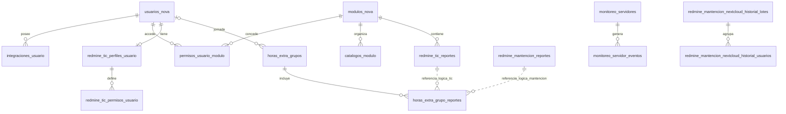

# Auditoría Base de Datos

Fecha: 11 de septiembre de 2026. Proyecto: NOVA. Auditoría de código, esquema real y consultas de solo lectura.

## 1. Resumen ejecutivo

Se identificaron **23 hallazgos: 0 CRÍTICOS, 11 ALTOS, 12 MEDIOS y 0 BAJOS**. Las prioridades son limitar los privilegios de la cuenta de aplicación, proteger las credenciales y el transporte, conciliar vínculos de horas extra y corregir operaciones de escritura que pueden perder datos o quedar parcialmente aplicadas.

La conexión configurada en el entorno local utiliza **MariaDB 12.3.2-MariaDB-ubu2404**. Se observaron **34 tablas InnoDB, 316 columnas, 34 claves primarias, 135 índices en total, 29 claves foráneas y 5 CHECK**, estos últimos para validar JSON de logs. Hay **7 triggers**, ninguna vista, ninguna rutina almacenada y ningún evento programado en este esquema. Los 83 nombres de migraciones del directorio coinciden con los 83 registrados en `migrations`; esto no certifica que el esquema sea reproducible exactamente a partir de ellas.

Las comprobaciones agregadas encontraron **28 reportes TIC vinculados a dos grupos de horas extra**, y **28 vínculos TIC cuya fecha de grupo difiere de la fecha actual de inicio/reporte**. Se encontró un grupo sin vínculos. No se encontraron huérfanos en las 29 FK declaradas ni en las referencias polimórficas de reportes comprobadas. Tampoco se observaron duplicados en las claves externas de catálogos, claves de origen de Mantención, tickets por módulo o bindings Telegram examinados. La ausencia actual de duplicados no sustituye una restricción cuando el código depende de unicidad.

La cuenta configurada es `root` y `SHOW GRANTS` confirmó `ALL PRIVILEGES` sobre `*.*`, además de capacidad de otorgar privilegios. La conexión auditada no negoció TLS; el servidor soporta SSL pero no exige transporte seguro. Los riesgos de acceso al repositorio aumentan porque existe una copia versionada de la configuración local con secretos. No se imprimieron ni se incorporaron sus valores al informe.

Se ejecutaron exclusivamente consultas **SELECT**, **SHOW** y **EXPLAIN de SELECT**, además de lecturas de archivos y una comprobación PHP aislada sin conexión real. **No se ejecutaron cambios de datos, DDL, migraciones, análisis que actualicen estadísticas, EXPLAIN ANALYZE ni procedimientos de aplicación.** No se arrancó Laravel: algunos métodos de lectura incluyen migración/cifrado diferido o creación de registros y no son apropiados para esta etapa. La conexión directa PDO obtuvo las credenciales en memoria.

Los índices propuestos distinguen integridad de rendimiento. Se obtuvieron planes actuales, pero no se crearon índices hipotéticos ni se midió una alternativa en una copia. Por ello, las propuestas de optimización que requieren contraste se marcan **REQUIERE VERIFICACIÓN CON EXPLAIN / PLAN DE EJECUCIÓN** después de implementar la alternativa en un entorno de prueba. Un `ALL`/filesort sobre una tabla pequeña no demuestra por sí solo una regresión de producción.

**Alcance de las conclusiones.** Se auditó la base indicada por el `.env` local; no se presupone que sea idéntica a todos los despliegues Docker/producción. Las lecturas se hicieron en distintos instantes y no constituyen un snapshot transaccional global. No se consultaron listados de datos personales ni contenidos de reportes. No se probaron restauraciones, concurrencia destructiva, rotaciones, carga ni validez de credenciales externas. Las hipótesis causales y cambios que necesitan decisión funcional se señalan expresamente. El único archivo creado es este informe; las otras auditorías y el código permanecen intactos.

## 2. Motor y arquitectura identificada

| Aspecto | Evidencia observada |
| --- | --- |
| Motor/versión | `SELECT VERSION()`: MariaDB `12.3.2-MariaDB-ubu2404`. |
| Almacenamiento | Las 34 tablas son InnoDB. |
| Charset/collation | `utf8mb4` / `utf8mb4_unicode_ci`. |
| SQL mode de la conexión auditada | `STRICT_TRANS_TABLES,ERROR_FOR_DIVISION_BY_ZERO,NO_AUTO_CREATE_USER,NO_ENGINE_SUBSTITUTION`. Laravel configura además `strict=true`; no se asume que ambas sesiones tengan exactamente el mismo SQL mode. |
| Driver/configuración | PDO MySQL; `config/database.php:46`; `DB_CONNECTION=mysql`; no `DATABASE_URL` en el entorno leído. |
| Framework | Laravel 12.62.0 en el lock; Query Builder/Eloquent y servicios/repositorios modulares. |
| Identidad | `usuarios_nova`, integraciones personales y accesos centrales; perfiles y permisos específicos de TIC/Mantención. |
| Operación | Reportes separados para TIC/Mantención; jornada compartida de horas extra por usuario/fecha y pivot con origen. |
| Configuración | `nova_settings`, `configuraciones_modulo`, opciones/catálogos relacionales. JSON de contexto en logs es deliberado. |
| Automatización DB | Siete triggers `BEFORE UPDATE` asignan `NEW.actualizado_at=CURRENT_TIMESTAMP`. No hay views, procedures, functions ni eventos del esquema. Las tareas programadas de negocio viven en PHP/CLI. |
| Tamaño asignado observado | Datos: 9.240.576 bytes; índices: 3.653.632 bytes. Valores de metadatos InnoDB, no tamaño de un backup ni medición de crecimiento. |
| Evolución | 83 archivos de migración, 83 nombres aplicados, sin pendientes ni nombres aplicados ausentes del directorio. |

Los dumps SQL de raíz representan estados históricos y no se tomaron como esquema vigente. Tampoco se tomó como actual la descripción histórica de AGENTS.md sobre tablas de horas separadas o storage Mantención: no están presentes en la base inspeccionada. Las migraciones y el código se contrastaron con `information_schema`.

## 3. Modelo de datos

Todas las tablas tienen PK `id`; es `BIGINT UNSIGNED AUTO_INCREMENT` salvo `migrations.id`, que es `INT UNSIGNED AUTO_INCREMENT`. La siguiente matriz enumera las **34 tablas**, sus relaciones principales y restricciones de identidad. El inventario detallado de columnas e índices aparece al final de esta sección.

| Tabla | Identidad lógica / UNIQUE adicional | Relaciones y función |
| --- | --- | --- |
| `usuarios_nova` | `uuid`, `usuario`, `rut`, `redmine_id` únicos; RUT/Redmine admiten NULL | Identidad; rol/estado central, hash y datos personales. Redmine ID es `VARCHAR(80)` en esta base. |
| `integraciones_usuario` | `(usuario_id,tipo)` | FK a usuario; login externo y secreto cifrado por la aplicación. |
| `modulos_nova` | `clave_modulo` | Registro, orden, habilitación y mantenimiento. |
| `permisos_usuario_modulo` | `(usuario_id,modulo_id)` | FK a usuario y módulo; acceso y rol modular. |
| `destinatarios_informes_modulo` | `(modulo_id,usuario_id)` | FK a módulo/usuario; destinatario/jefatura. |
| `nova_settings` | `clave` | Configuración global tipada, incluidos valores secretos cifrados. |
| `configuraciones_modulo` | `(modulo_id,clave)` | FK a módulo; configuración tipada. |
| `catalogos_modulo` | `(modulo_id,tipo,clave_externa)`; externa nullable | FK a módulo; categorías/unidades TIC. |
| `categorias` | Sin UNIQUE de negocio | FK nullable a módulo; categorías de Mantención y copias históricas. |
| `unidades` | Sin UNIQUE de negocio | FK nullable a módulo; no sustituye `unidad_texto` de reportes Mantención. |
| `modulo_opciones` | `(modulo_id,tipo,id_externo)`; externo nullable | FK a módulo; tracker/prioridad/estado. |
| `redmine_tic_reportes` | Ticket remoto indexado, no único | FK a módulo, tres catálogos y `usuarios_nova.redmine_id` para asignado. |
| `redmine_mantencion_reportes` | Origen/ID de fuente indexados, no únicos | FK nullable a módulo/categoría; asignado Redmine como texto sin FK; campos propios CORE/manual. |
| `redmine_tic_perfiles_usuario` | `usuario_id` | FK a usuario; estado y rol TIC, membership remoto. |
| `redmine_tic_permisos_catalogo` | `clave` | Define clase de permiso; `tipo` es ENUM. |
| `redmine_tic_permisos_rol` | `(modulo_id,rol,clave)` | FK a módulo; no FK a clave de catálogo. |
| `redmine_tic_permisos_usuario` | `(perfil_id,clave)` | FK a perfil; valores bool/scope como texto. |
| `mantencion_permisos_rol` | `(rol,permiso)` | Permisos de rol propios; sin FK de rol. |
| `mantencion_permisos_usuario` | `(usuario_id,permiso)` | FK a usuario; overrides modulares. |
| `horas_extra_grupos` | `(usuario_id,fecha)`; usuario nullable | FK a usuario; horario y minutos de la jornada compartida. |
| `horas_extra_grupo_reportes` | `(grupo_id,origen,reporte_id)` | FK al grupo; origen/reporte es relación polimórfica sin FK al reporte. |
| `emach_horarios_usuario` | `(usuario_id,dia_semana)` | FK a usuario; horario semanal con TIME. |
| `monitoreo_servidores` | Sin UNIQUE funcional obligatorio identificado | FK nullable de creador a usuario; destino/configuración/estado. Hosts repetidos pueden representar puertos o servicios distintos. |
| `monitoreo_servidor_eventos` | PK | FK a servidor; transición y resultados de notificación. |
| `monitoreo_alerta_usuarios` | `usuario_id` | FK a usuario; preferencias de destinatario. |
| `monitoreo_workers` | `instancia` | Heartbeat de workers. |
| `redmine_mantencion_nextcloud_historial_lotes` | `numero_lote`, nullable | Cabecera y snapshot de solicitante; fecha local más timestamps. |
| `redmine_mantencion_nextcloud_historial_usuarios` | PK | FK a lote; resultado por cuenta externa, no identidad NOVA duplicada. |
| `nova_audit_logs` | PK | Auditoría global; usuario/nombre como snapshot, contexto JSON validado. |
| `tic_log` | PK | FK a módulo; evento y contexto operacional. |
| `mantencion_log` | PK | Canal/tipo/mensaje; contexto operacional. |
| `emach_log` | PK | Evento/usuario/detalle/contexto. |
| `telegram_log` | PK | Evento/usuario/detalle/contexto. |
| `migrations` | PK | Historial Laravel; no inventario completo de diferencias de esquema. |



Las dos referencias de reportes al pivot son lógicas y dependientes de `origen`; no son FK físicas ni deben interpretarse como ambas obligatorias a la vez.

**Tipos y normalización.** Las fechas/horas operacionales principales son DATE, TIME, DATETIME o TIMESTAMP; `tiempo_estimado` es `DECIMAL(10,2)` y `total_minutos` es entero, adecuados para evitar floats en almacenamiento. Los IDs externos no deben convertirse masivamente a enteros solo por su aspecto: `clave_externa`, `usuario_externo`, `fuente_id`, RUT y Chat ID son identificadores, no cantidades. Sí hay una incompatibilidad entre parámetros enteros del backend y columnas de ID textual en DB-015. Los TEXT/LONGTEXT de descripción, mensajes, secretos cifrados y contexto tienen una función identificable; no se recomienda reducirlos sin medir máximos y consumidores. Los nombres/estados duplicados de reportes pueden ser snapshots o datos de sistemas distintos; no se propone borrarlos por redundancia aparente.

**NULL, defaults y CHECK.** Identidad principal exige usuario/nombre/apellido/hash; los identificadores externos opcionales admiten NULL. Los estados centrales y de perfiles tienen default activo; el importador TIC aplica explícitamente bloqueado para nuevos perfiles, por lo que ese default DB merece revisión de futuras vías de alta, sin afirmar altas indebidas observadas. Las tablas de reportes admiten muchos NULL de integración; hacerlas todas NOT NULL rompería datos parciales legítimos. Hay cinco CHECK `json_valid(contexto)` en los cinco logs. No hay CHECK de dominio para booleanos, rangos horarios o cantidades no negativas; los conteos de valores inválidos examinados fueron cero (DB-022).

**Inventario técnico completo.** Fuente: `information_schema.COLUMNS` y `STATISTICS` de la conexión auditada. `!` significa NOT NULL, `?` permite NULL; el texto después de `=` es DEFAULT. Se omiten defaults de columnas sensibles. `UNIQUE` incluye PK cuando el nombre es PRIMARY. Los valores son definición de esquema, no registros de usuarios.

<details>
<summary>Diccionario completo de columnas (34 tablas, 316 columnas)</summary>

**`catalogos_modulo`**

```text
id:bigint(20) unsigned! [auto_increment]
modulo_id:bigint(20) unsigned!
tipo:varchar(40)!
clave_externa:varchar(100)?=NULL
nombre:varchar(255)!
predeterminado:tinyint(1)!=0
activo:tinyint(1)!=1
creado_at:timestamp!=current_timestamp()
actualizado_at:timestamp!=current_timestamp()
```

**`categorias`**

```text
id:bigint(20) unsigned! [auto_increment]
modulo_id:bigint(20) unsigned?=NULL
nombre:varchar(255)!
clave_externa:varchar(120)?=NULL
activo:tinyint(1)!=1
predeterminado:tinyint(1)!=0
creado_at:timestamp!=current_timestamp()
actualizado_at:timestamp!=current_timestamp() [on update current_timestamp()]
```

**`configuraciones_modulo`**

```text
id:bigint(20) unsigned! [auto_increment]
modulo_id:bigint(20) unsigned!
clave:varchar(120)!
valor:text?=NULL
tipo:varchar(30)!='string'
creado_at:timestamp!=current_timestamp()
actualizado_at:timestamp!=current_timestamp() [on update current_timestamp()]
```

**`destinatarios_informes_modulo`**

```text
id:bigint(20) unsigned! [auto_increment]
modulo_id:bigint(20) unsigned!
usuario_id:bigint(20) unsigned!
recibe_informe:tinyint(1)!=0
es_jefatura:tinyint(1)!=0
creado_at:timestamp!=current_timestamp()
actualizado_at:timestamp!=current_timestamp() [on update current_timestamp()]
```

**`emach_horarios_usuario`**

```text
id:bigint(20) unsigned! [auto_increment]
usuario_id:bigint(20) unsigned!
dia_semana:tinyint(3) unsigned!
activo:tinyint(1)!=0
hora_entrada:time?=NULL
hora_salida:time?=NULL
creado_at:timestamp!=current_timestamp()
actualizado_at:timestamp!=current_timestamp() [on update current_timestamp()]
```

**`emach_log`**

```text
id:bigint(20) unsigned! [auto_increment]
evento:varchar(120)!
usuario_id:varchar(160)?=NULL
detalle:text?=NULL
contexto:longtext?=NULL
registrado_at:timestamp!=current_timestamp()
```

**`horas_extra_grupos`**

```text
id:bigint(20) unsigned! [auto_increment]
usuario_id:bigint(20) unsigned?=NULL
fecha:date!
hora_inicio:time?=NULL
hora_fin:time?=NULL
total_minutos:int(10) unsigned?=NULL
creado_at:timestamp!=current_timestamp()
actualizado_at:timestamp!=current_timestamp() [on update current_timestamp()]
```

**`horas_extra_grupo_reportes`**

```text
id:bigint(20) unsigned! [auto_increment]
grupo_id:bigint(20) unsigned!
origen:varchar(30)!
reporte_id:bigint(20) unsigned!
creado_at:timestamp!=current_timestamp()
actualizado_at:timestamp!=current_timestamp() [on update current_timestamp()]
```

**`integraciones_usuario`**

```text
id:bigint(20) unsigned! [auto_increment]
usuario_id:bigint(20) unsigned!
tipo:varchar(40)!
usuario_externo:varchar(180)?=NULL
valor_secreto:text?
creado_at:timestamp!=current_timestamp()
actualizado_at:timestamp?=NULL [on update current_timestamp()]
```

**`mantencion_log`**

```text
id:bigint(20) unsigned! [auto_increment]
canal:varchar(30)!
tipo:varchar(80)?=NULL
mensaje_id:varchar(160)?=NULL
detalle:text?=NULL
contexto:longtext?=NULL
registrado_at:timestamp!=current_timestamp()
```

**`mantencion_permisos_rol`**

```text
id:bigint(20) unsigned! [auto_increment]
rol:varchar(40)!
permiso:varchar(80)!
valor:varchar(255)!=''
```

**`mantencion_permisos_usuario`**

```text
id:bigint(20) unsigned! [auto_increment]
usuario_id:bigint(20) unsigned!
permiso:varchar(80)!
valor:varchar(255)!=''
actualizado_at:timestamp!=current_timestamp() [on update current_timestamp()]
```

**`migrations`**

```text
id:int(10) unsigned! [auto_increment]
migration:varchar(255)!
batch:int(11)!
```

**`modulos_nova`**

```text
id:bigint(20) unsigned! [auto_increment]
clave_modulo:varchar(80)!
nombre:varchar(160)!
descripcion:text?=NULL
icono:varchar(80)?=NULL
tipo:varchar(40)!='native'
ruta:varchar(500)?=NULL
entrada:varchar(255)?=NULL
habilitado:tinyint(1)!=1
en_mantencion:tinyint(1)!=0
orden:int(11)!=100
creado_at:timestamp!=current_timestamp()
actualizado_at:timestamp?=NULL [on update current_timestamp()]
```

**`modulo_opciones`**

```text
id:bigint(20) unsigned! [auto_increment]
modulo_id:bigint(20) unsigned!
tipo:varchar(40)!
id_externo:varchar(100)?=NULL
nombre:varchar(255)!
predeterminado:tinyint(1)!=0
activo:tinyint(1)!=1
orden:int(10) unsigned!=100
creado_at:timestamp!=current_timestamp()
actualizado_at:timestamp!=current_timestamp() [on update current_timestamp()]
```

**`monitoreo_alerta_usuarios`**

```text
id:bigint(20) unsigned! [auto_increment]
usuario_id:bigint(20) unsigned!
activo:tinyint(1)!=1
recibir_caidas:tinyint(1)!=1
recibir_recuperaciones:tinyint(1)!=1
creado_at:timestamp!=current_timestamp()
actualizado_at:timestamp!=current_timestamp() [on update current_timestamp()]
```

**`monitoreo_servidores`**

```text
id:bigint(20) unsigned! [auto_increment]
nombre:varchar(160)!
host:varchar(255)!
tipo:varchar(20)!='tcp'
puerto:smallint(5) unsigned?=NULL
ruta:varchar(500)?=NULL
verificar_ssl:tinyint(1)!=0
intervalo_segundos:int(10) unsigned!=60
timeout_segundos:smallint(5) unsigned!=5
fallos_para_alertar:smallint(5) unsigned!=3
activo:tinyint(1)!=1
mantenimiento_desde:datetime?=NULL
mantenimiento_hasta:datetime?=NULL
mantenimiento_motivo:varchar(255)?=NULL
estado:varchar(20)!='pendiente'
fallos_consecutivos:smallint(5) unsigned!=0
latencia_ms:int(10) unsigned?=NULL
ultimo_error:text?=NULL
ultimo_chequeo_at:datetime?=NULL
ultima_respuesta_at:datetime?=NULL
caido_desde:datetime?=NULL
alertado_caida_at:datetime?=NULL
creado_por:bigint(20) unsigned?=NULL
creado_at:timestamp!=current_timestamp()
actualizado_at:timestamp!=current_timestamp() [on update current_timestamp()]
```

**`monitoreo_servidor_eventos`**

```text
id:bigint(20) unsigned! [auto_increment]
servidor_id:bigint(20) unsigned!
tipo:varchar(30)!
estado_anterior:varchar(20)?=NULL
estado_nuevo:varchar(20)!
detalle:text?=NULL
latencia_ms:int(10) unsigned?=NULL
ocurrido_at:datetime!
notificado_at:datetime?=NULL
destinatarios_notificados:smallint(5) unsigned!=0
fallos_notificacion:smallint(5) unsigned!=0
creado_at:timestamp!=current_timestamp()
actualizado_at:timestamp!=current_timestamp() [on update current_timestamp()]
```

**`monitoreo_workers`**

```text
id:bigint(20) unsigned! [auto_increment]
instancia:varchar(160)!
ultimo_ciclo_at:datetime?=NULL
servidores_comprobados:int(10) unsigned!=0
ultimo_error:text?=NULL
creado_at:timestamp!=current_timestamp()
actualizado_at:timestamp!=current_timestamp() [on update current_timestamp()]
```

**`nova_audit_logs`**

```text
id:bigint(20) unsigned! [auto_increment]
event:varchar(80)!
message:varchar(500)!
user_id:varchar(160)!=''
user_name:varchar(255)!=''
ip:varchar(45)!=''
contexto:longtext?=NULL
registrado_at:timestamp!=current_timestamp()
```

**`nova_settings`**

```text
id:bigint(20) unsigned! [auto_increment]
clave:varchar(80)!
valor:text?=NULL
tipo:varchar(20)!='string'
actualizado_at:timestamp!=current_timestamp() [on update current_timestamp()]
```

**`permisos_usuario_modulo`**

```text
id:bigint(20) unsigned! [auto_increment]
usuario_id:bigint(20) unsigned!
modulo_id:bigint(20) unsigned!
permitido:tinyint(1)!=0
rol_modulo:varchar(40)?=NULL
creado_at:timestamp!=current_timestamp()
actualizado_at:timestamp?=NULL [on update current_timestamp()]
```

**`redmine_mantencion_nextcloud_historial_lotes`**

```text
id:bigint(20) unsigned! [auto_increment]
numero_lote:bigint(20) unsigned?=NULL
solicitante_nombre:varchar(200)?=NULL
solicitante_rut:varchar(20)?=NULL
solicitante_correo:varchar(190)?=NULL
created_at_cl:datetime!
created_at:timestamp?=NULL
updated_at:timestamp?=NULL
```

**`redmine_mantencion_nextcloud_historial_usuarios`**

```text
id:bigint(20) unsigned! [auto_increment]
lote_id:bigint(20) unsigned!
tipo:varchar(20)!
userid:varchar(255)?=NULL
display_name:varchar(255)?=NULL
email:varchar(255)?=NULL
grupo:varchar(255)?=NULL
status:varchar(255)?=NULL
message:text?=NULL
created_at:timestamp?=NULL
updated_at:timestamp?=NULL
```

**`redmine_mantencion_reportes`**

```text
id:bigint(20) unsigned! [auto_increment]
modulo_id:bigint(20) unsigned?=NULL
fuente:varchar(40)?=NULL
fuente_id:varchar(160)?=NULL
id_core:varchar(160)?=NULL
proyecto:varchar(180)?=NULL
project_id:varchar(80)?=NULL
tipo:varchar(120)?=NULL
tipo_id:varchar(80)?=NULL
asunto:text?=NULL
descripcion:longtext?=NULL
estado:varchar(80)?=NULL
estado_redmine:varchar(120)?=NULL
estado_id:varchar(80)?=NULL
prioridad:varchar(80)?=NULL
priority_id:varchar(80)?=NULL
id_redmine_asignado:varchar(80)?=NULL
asignado_nombre:varchar(180)?=NULL
categoria_id:bigint(20) unsigned?=NULL
solicitante:varchar(255)?=NULL
anexo:varchar(120)?=NULL
unidad_texto:varchar(255)?=NULL
fecha_inicio:date?=NULL
fecha_fin:date?=NULL
fecha_reporte:date?=NULL
hora_reporte:time?=NULL
tiempo_estimado:decimal(10,2)?=NULL
correo:varchar(255)?=NULL
hora_extra:tinyint(1)!=0
numero_ticket_redmine:int(10) unsigned?=NULL
creado_at:timestamp!=current_timestamp()
actualizado_at:timestamp!=current_timestamp() [on update current_timestamp()]
```

**`redmine_tic_perfiles_usuario`**

```text
id:bigint(20) unsigned! [auto_increment]
usuario_id:bigint(20) unsigned!
rol:varchar(40)!='usuario'
estado_usuario:varchar(40)!='activo'
redmine_membership_id:int(10) unsigned?=NULL
creado_at:timestamp!=current_timestamp()
actualizado_at:timestamp!=current_timestamp() [on update current_timestamp()]
```

**`redmine_tic_permisos_catalogo`**

```text
id:bigint(20) unsigned! [auto_increment]
clave:varchar(60)!
tipo:enum('bool','scope','scope_or_empty')!='bool'
descripcion:varchar(200)!=''
orden:tinyint(3) unsigned!=100
```

**`redmine_tic_permisos_rol`**

```text
id:bigint(20) unsigned! [auto_increment]
modulo_id:bigint(20) unsigned!
rol:varchar(40)!
clave:varchar(60)!
valor:varchar(20)!='no'
actualizado_at:timestamp!=current_timestamp() [on update current_timestamp()]
```

**`redmine_tic_permisos_usuario`**

```text
id:bigint(20) unsigned! [auto_increment]
perfil_id:bigint(20) unsigned!
clave:varchar(60)!
valor:varchar(20)!='no'
actualizado_at:timestamp!=current_timestamp() [on update current_timestamp()]
```

**`redmine_tic_reportes`**

```text
id:bigint(20) unsigned! [auto_increment]
modulo_id:bigint(20) unsigned!
redmine_id:int(10) unsigned?=NULL
estado:varchar(20)!='pendiente'
estado_redmine:varchar(40)?=NULL
tipo:varchar(40)?=NULL
prioridad:varchar(20)?=NULL
categoria_catalogo_id:bigint(20) unsigned?=NULL
unidad_catalogo_id:bigint(20) unsigned?=NULL
unidad_texto:varchar(180)?=NULL
unidad_solicitante_catalogo_id:bigint(20) unsigned?=NULL
solicitante:varchar(255)?=NULL
asunto:text?=NULL
descripcion:longtext?=NULL
fecha:date?=NULL
hora:time?=NULL
fecha_inicio:date?=NULL
fecha_fin:date?=NULL
chat_id_telegram:varchar(120)?=NULL
mensaje:text?=NULL
asignado_a:varchar(80)?=NULL
hora_extra:tinyint(1)!=0
tiempo_estimado:decimal(10,2)?=NULL
origen:varchar(40)?=NULL
procesado_at:datetime?=NULL
creado_at:timestamp!=current_timestamp()
actualizado_at:timestamp?=NULL [on update current_timestamp()]
```

**`telegram_log`**

```text
id:bigint(20) unsigned! [auto_increment]
evento:varchar(120)!
usuario_id:varchar(160)?=NULL
detalle:text?=NULL
contexto:longtext?=NULL
registrado_at:timestamp!=current_timestamp()
```

**`tic_log`**

```text
id:bigint(20) unsigned! [auto_increment]
modulo_id:bigint(20) unsigned!
evento:varchar(120)!
contexto:longtext?=NULL
linea:text?=NULL
creado_at:timestamp!=current_timestamp()
```

**`unidades`**

```text
id:bigint(20) unsigned! [auto_increment]
modulo_id:bigint(20) unsigned?=NULL
nombre:varchar(255)!
clave_externa:varchar(120)?=NULL
activo:tinyint(1)!=1
predeterminado:tinyint(1)!=0
creado_at:timestamp!=current_timestamp()
actualizado_at:timestamp!=current_timestamp() [on update current_timestamp()]
```

**`usuarios_nova`**

```text
id:bigint(20) unsigned! [auto_increment]
uuid:char(36)!
usuario:varchar(80)!
rut:varchar(20)?=NULL
redmine_id:varchar(80)?=NULL
nombre:varchar(120)!
apellido:varchar(160)!
rol:varchar(40)!='usuario'
estado:varchar(40)!='activo'
password:varchar(255)!
usuario_core:varchar(120)?=NULL
telegram_id_chat:varchar(120)?=NULL
ultimo_login_at:datetime?=NULL
creado_at:timestamp!=current_timestamp()
actualizado_at:timestamp!=current_timestamp()
```

</details>

<details>
<summary>Definiciones de los 135 índices observados</summary>

```text
catalogos_modulo idx_catalogos_nombre INDEX (nombre)
catalogos_modulo idx_catalogos_tipo INDEX (tipo)
catalogos_modulo PRIMARY UNIQUE (id)
catalogos_modulo uq_catalogo_modulo_item UNIQUE (modulo_id,tipo,clave_externa)
categorias categorias_activo_index INDEX (activo)
categorias categorias_modulo_id_index INDEX (modulo_id)
categorias PRIMARY UNIQUE (id)
configuraciones_modulo idx_configuraciones_modulo_clave INDEX (clave)
configuraciones_modulo PRIMARY UNIQUE (id)
configuraciones_modulo uq_configuracion_modulo_clave UNIQUE (modulo_id,clave)
destinatarios_informes_modulo destinatarios_informes_modulo_usuario_id_foreign INDEX (usuario_id)
destinatarios_informes_modulo idx_destinatario_informe INDEX (modulo_id,recibe_informe)
destinatarios_informes_modulo idx_jefatura_informe INDEX (modulo_id,es_jefatura)
destinatarios_informes_modulo PRIMARY UNIQUE (id)
destinatarios_informes_modulo uq_destinatario_informe_modulo_usuario UNIQUE (modulo_id,usuario_id)
emach_horarios_usuario idx_emach_horario_usuario_activo INDEX (usuario_id,activo)
emach_horarios_usuario PRIMARY UNIQUE (id)
emach_horarios_usuario uq_emach_horario_usuario_dia UNIQUE (usuario_id,dia_semana)
emach_log emach_log_evento_index INDEX (evento)
emach_log emach_log_registrado_at_index INDEX (registrado_at)
emach_log emach_log_usuario_id_index INDEX (usuario_id)
emach_log PRIMARY UNIQUE (id)
horas_extra_grupos idx_horas_extra_fecha INDEX (fecha)
horas_extra_grupos PRIMARY UNIQUE (id)
horas_extra_grupos uq_horas_extra_usuario_fecha UNIQUE (usuario_id,fecha)
horas_extra_grupo_reportes idx_he_origen_reporte INDEX (origen,reporte_id)
horas_extra_grupo_reportes PRIMARY UNIQUE (id)
horas_extra_grupo_reportes uq_he_reporte UNIQUE (grupo_id,origen,reporte_id)
integraciones_usuario idx_integraciones_usuario_externo INDEX (usuario_externo)
integraciones_usuario PRIMARY UNIQUE (id)
integraciones_usuario uq_integracion_usuario_tipo UNIQUE (usuario_id,tipo)
mantencion_log PRIMARY UNIQUE (id)
mantencion_log redmine_mantencion_eventos_canal_index INDEX (canal)
mantencion_log redmine_mantencion_eventos_mensaje_id_index INDEX (mensaje_id)
mantencion_log redmine_mantencion_eventos_registrado_at_index INDEX (registrado_at)
mantencion_log redmine_mantencion_eventos_tipo_index INDEX (tipo)
mantencion_permisos_rol mantencion_permisos_rol_rol_index INDEX (rol)
mantencion_permisos_rol PRIMARY UNIQUE (id)
mantencion_permisos_rol uq_mpr_rol_permiso UNIQUE (rol,permiso)
mantencion_permisos_usuario PRIMARY UNIQUE (id)
mantencion_permisos_usuario uq_mpu_usuario_permiso UNIQUE (usuario_id,permiso)
migrations PRIMARY UNIQUE (id)
modulos_nova idx_modulos_nova_orden INDEX (orden)
modulos_nova idx_modulos_nova_tipo INDEX (tipo)
modulos_nova PRIMARY UNIQUE (id)
modulos_nova uq_modulos_nova_clave UNIQUE (clave_modulo)
modulo_opciones idx_modulo_opciones_tipo INDEX (tipo)
modulo_opciones PRIMARY UNIQUE (id)
modulo_opciones uq_modulo_opcion_tipo_ext UNIQUE (modulo_id,tipo,id_externo)
monitoreo_alerta_usuarios PRIMARY UNIQUE (id)
monitoreo_alerta_usuarios uq_monitor_alerta_usuario UNIQUE (usuario_id)
monitoreo_servidores monitoreo_servidores_activo_index INDEX (activo)
monitoreo_servidores monitoreo_servidores_creado_por_foreign INDEX (creado_por)
monitoreo_servidores monitoreo_servidores_estado_index INDEX (estado)
monitoreo_servidores monitoreo_servidores_mantenimiento_hasta_index INDEX (mantenimiento_hasta)
monitoreo_servidores monitoreo_servidores_tipo_index INDEX (tipo)
monitoreo_servidores monitoreo_servidores_ultimo_chequeo_at_index INDEX (ultimo_chequeo_at)
monitoreo_servidores PRIMARY UNIQUE (id)
monitoreo_servidor_eventos idx_monitor_evento_servidor_fecha INDEX (servidor_id,ocurrido_at)
monitoreo_servidor_eventos monitoreo_servidor_eventos_ocurrido_at_index INDEX (ocurrido_at)
monitoreo_servidor_eventos monitoreo_servidor_eventos_tipo_index INDEX (tipo)
monitoreo_servidor_eventos PRIMARY UNIQUE (id)
monitoreo_workers monitoreo_workers_instancia_unique UNIQUE (instancia)
monitoreo_workers monitoreo_workers_ultimo_ciclo_at_index INDEX (ultimo_ciclo_at)
monitoreo_workers PRIMARY UNIQUE (id)
nova_audit_logs idx_audit_user_date INDEX (user_id,registrado_at)
nova_audit_logs nova_audit_logs_event_index INDEX (event)
nova_audit_logs nova_audit_logs_registrado_at_index INDEX (registrado_at)
nova_audit_logs PRIMARY UNIQUE (id)
nova_settings nova_settings_clave_unique UNIQUE (clave)
nova_settings PRIMARY UNIQUE (id)
permisos_usuario_modulo fk_permisos_modulo INDEX (modulo_id)
permisos_usuario_modulo PRIMARY UNIQUE (id)
permisos_usuario_modulo uq_permiso_usuario_modulo UNIQUE (usuario_id,modulo_id)
redmine_mantencion_nextcloud_historial_lotes PRIMARY UNIQUE (id)
redmine_mantencion_nextcloud_historial_lotes redmine_mantencion_nextcloud_historial_lotes_created_at_cl_index INDEX (created_at_cl)
redmine_mantencion_nextcloud_historial_lotes rm_nextcloud_lotes_numero_unique UNIQUE (numero_lote)
redmine_mantencion_nextcloud_historial_usuarios PRIMARY UNIQUE (id)
redmine_mantencion_nextcloud_historial_usuarios redmine_mantencion_nextcloud_historial_usuarios_lote_id_foreign INDEX (lote_id)
redmine_mantencion_nextcloud_historial_usuarios redmine_mantencion_nextcloud_historial_usuarios_tipo_index INDEX (tipo)
redmine_mantencion_reportes idx_rm_reportes_fuente_id INDEX (fuente,fuente_id)
redmine_mantencion_reportes PRIMARY UNIQUE (id)
redmine_mantencion_reportes redmine_mantencion_reportes_categoria_id_foreign INDEX (categoria_id)
redmine_mantencion_reportes redmine_mantencion_reportes_estado_index INDEX (estado)
redmine_mantencion_reportes redmine_mantencion_reportes_fecha_inicio_index INDEX (fecha_inicio)
redmine_mantencion_reportes redmine_mantencion_reportes_hora_extra_index INDEX (hora_extra)
redmine_mantencion_reportes redmine_mantencion_reportes_id_core_index INDEX (id_core)
redmine_mantencion_reportes redmine_mantencion_reportes_id_redmine_asignado_index INDEX (id_redmine_asignado)
redmine_mantencion_reportes redmine_mantencion_reportes_modulo_id_foreign INDEX (modulo_id)
redmine_mantencion_reportes redmine_mantencion_reportes_numero_ticket_redmine_index INDEX (numero_ticket_redmine)
redmine_tic_perfiles_usuario PRIMARY UNIQUE (id)
redmine_tic_perfiles_usuario redmine_tic_perfiles_usuario_estado_usuario_index INDEX (estado_usuario)
redmine_tic_perfiles_usuario redmine_tic_perfiles_usuario_rol_index INDEX (rol)
redmine_tic_perfiles_usuario uq_redmine_tic_perfil_usuario UNIQUE (usuario_id)
redmine_tic_permisos_catalogo PRIMARY UNIQUE (id)
redmine_tic_permisos_catalogo redmine_tic_permisos_catalogo_clave_unique UNIQUE (clave)
redmine_tic_permisos_rol idx_pr_rol INDEX (modulo_id,rol)
redmine_tic_permisos_rol PRIMARY UNIQUE (id)
redmine_tic_permisos_rol uq_permiso_rol UNIQUE (modulo_id,rol,clave)
redmine_tic_permisos_usuario idx_pu_clave INDEX (clave)
redmine_tic_permisos_usuario PRIMARY UNIQUE (id)
redmine_tic_permisos_usuario uq_permiso_usuario UNIQUE (perfil_id,clave)
redmine_tic_reportes idx_reportes_asignado INDEX (asignado_a)
redmine_tic_reportes idx_reportes_categoria INDEX (categoria_catalogo_id)
redmine_tic_reportes idx_reportes_fecha INDEX (fecha)
redmine_tic_reportes idx_reportes_modulo_asignado_estado INDEX (modulo_id,asignado_a,estado)
redmine_tic_reportes idx_reportes_modulo_estado INDEX (modulo_id,estado)
redmine_tic_reportes idx_reportes_modulo_estado_fecha INDEX (modulo_id,estado,fecha)
redmine_tic_reportes idx_reportes_origen INDEX (origen)
redmine_tic_reportes idx_reportes_redmine_id INDEX (redmine_id)
redmine_tic_reportes idx_reportes_unidad INDEX (unidad_catalogo_id)
redmine_tic_reportes idx_reportes_unidad_solicitante INDEX (unidad_solicitante_catalogo_id)
redmine_tic_reportes PRIMARY UNIQUE (id)
redmine_tic_reportes redmine_tic_reportes_fecha_fin_index INDEX (fecha_fin)
redmine_tic_reportes redmine_tic_reportes_fecha_inicio_index INDEX (fecha_inicio)
telegram_log PRIMARY UNIQUE (id)
telegram_log telegram_log_evento_index INDEX (evento)
telegram_log telegram_log_registrado_at_index INDEX (registrado_at)
telegram_log telegram_log_usuario_id_index INDEX (usuario_id)
tic_log idx_redmine_tic_activity_modulo_fecha INDEX (modulo_id,creado_at)
tic_log PRIMARY UNIQUE (id)
tic_log redmine_tic_activity_logs_evento_index INDEX (evento)
unidades PRIMARY UNIQUE (id)
unidades unidades_activo_index INDEX (activo)
unidades unidades_modulo_id_index INDEX (modulo_id)
usuarios_nova idx_usuarios_nova_estado INDEX (estado)
usuarios_nova idx_usuarios_nova_nombre INDEX (nombre,apellido)
usuarios_nova idx_usuarios_nova_rol INDEX (rol)
usuarios_nova idx_usuarios_nova_rol_estado INDEX (rol,estado)
usuarios_nova PRIMARY UNIQUE (id)
usuarios_nova uq_usuarios_nova_redmine_id UNIQUE (redmine_id)
usuarios_nova uq_usuarios_nova_rut UNIQUE (rut)
usuarios_nova uq_usuarios_nova_usuario UNIQUE (usuario)
usuarios_nova uq_usuarios_nova_uuid UNIQUE (uuid)
usuarios_nova usuarios_nova_telegram_id_chat_index INDEX (telegram_id_chat)
```

</details>

<details>
<summary>Triggers presentes</summary>

Los siete son BEFORE UPDATE y asignan CURRENT_TIMESTAMP a NEW.actualizado_at:

- `trg_usuarios_nova_actualizado`.
- `trg_permisos_usuario_modulo_actualizado`.
- `trg_catalogos_modulo_actualizado`.
- `trg_reportes_redmine_actualizado`.
- `trg_integraciones_usuario_actualizado`.
- `trg_modulos_nova_actualizado`.
- `trg_configuraciones_modulo_actualizado`.

No se incluyeron definers ni identidades de acceso en el inventario.

</details>

## 4. Integridad referencial

Se inspeccionaron las 29 FK y sus columnas; los tipos de ambos extremos coinciden en el esquema real. En particular, `redmine_tic_reportes.asignado_a` y `usuarios_nova.redmine_id` son `VARCHAR(80)`, y el padre tiene UNIQUE. No se reporta una FK con tipos incompatibles. Se comprobaron huérfanos con LEFT JOIN/COUNT para las 29 relaciones: **cero en el momento de lectura**.

Todas las FK tienen `UPDATE RESTRICT`. En DELETE, las políticas se distribuyen así:

- **CASCADE:** integraciones, permisos centrales, destinatarios, horarios EMACH, perfiles/permisos TIC, permisos personales Mantención y alertas respecto a sus padres; configuraciones/catálogos/opciones/roles TIC/reportes TIC/log TIC respecto al módulo; pivot respecto al grupo; eventos respecto al servidor; detalle Nextcloud respecto al lote.
- **SET NULL:** usuario del grupo de horas extra; creador del servidor; módulo de categorías/unidades/reportes Mantención; categoría de reporte Mantención; asignado y tres referencias de catálogo de reportes TIC.
- No se recomienda cambiar cascadas indiscriminadamente. Borrar un módulo puede borrar sus reportes TIC/logs; borrar un servidor elimina sus eventos; borrar un lote elimina detalles. Son consecuencias que deben formar parte del caso de uso y del backup, aunque no se detectó una operación accidental real. Los nombres de usuarios en auditoría y los datos del solicitante histórico son snapshots deliberados; una FK destructiva sobre ellos no sería necesariamente correcta.

Comprobaciones agregadas realizadas:

| Comprobación | Resultado | Interpretación |
| --- | --- | --- |
| Huérfanos en FK declaradas | 0 | Integridad de existencia conservada en la lectura. |
| Pivot hacia reportes inexistentes TIC/Mantención | 0 / 0 | No exime la omisión de cleanup en borrado: DB-011. |
| Origen desconocido en pivot | 0 | Los actuales son TIC/Mantención. |
| Reportes en varios grupos | 28, todos TIC, dos grupos cada uno | DB-004; conciliar con reglas de fecha e importación. |
| Vínculos con fecha distinta a inicio/reporte | TIC 28; Mantención 0 | La causa histórica exacta requiere verificación. |
| Grupos sin usuario / duplicados NULL-fecha | 0 / 0 | Riesgo permitido por diseño nullable: DB-012. |
| Grupos vacíos | 1 | Dato a revisar; no se eliminó. |
| Asignado del reporte distinto al usuario del grupo | 0 en ambos módulos | No se afirma mezcla de propietarios actualmente. |
| Minutos distintos del horario, considerando cruce de medianoche | 0 | La columna derivada estaba consistente en los registros comprobados. |
| Duplicados de fuente y CORE Mantención | 0 / 0 grupos | Unicidad no garantizada por DB: DB-008. |
| Duplicados de ticket por módulo | 0 TIC / 0 Mantención | No hay incidentes de duplicación de ID local observados; DB-021 trata también tickets remotos distintos. |
| Claves externas duplicadas categorías/unidades | 0 / 0 grupos | Falta restricción de negocio: DB-013. |
| Múltiples predeterminados en catálogo/opciones | 0 / 0 grupos | No se concluye que nunca puedan generarse. |
| Categoría TIC con módulo diferente | 0 | Las categorías referenciadas son del tipo `categoria`; no `categorias`. |
| Asignado Mantención no resuelto en identidad central | 0 | No se propone añadir FK sin decidir el tratamiento de históricos externos. |
| Chat ID duplicado no vacío | 0 grupos | Una futura unicidad depende de la política de grupos/destinatarios. |
| Nombre/apellido vacío | 0 | NOT NULL no equivale por sí solo a no vacío, pero no se observaron esos casos. |
| Claves de permisos personales TIC ausentes del catálogo | 0 distintas | La relación de claves no está protegida por FK; revisar al evolucionar permisos, sin agregar FK ciegamente. |

Los duplicados se cuentan como grupos de claves repetidas, no como número de filas a borrar. La auditoría no identificó qué vínculo conservar ni autoriza deduplicación automática.

## 5. Hallazgos críticos

**No se confirmó ningún hallazgo CRÍTICO.** No se probó acceso anónimo a la BD, compromiso efectivo, SQL Injection explotable ni pérdida masiva ocurrida. Privilegios root y secretos versionados son ALTOS por la evidencia actual; una exposición pública efectiva o acceso no autorizado confirmado requerirían reevaluar la severidad.

Las recomendaciones de integridad se consideran prioritarias incluso con bajo volumen de datos: un snapshot obsoleto puede restaurar una contraseña anterior, y una escritura parcial de permisos puede alterar autorización aunque la base ocupe pocos megabytes.

## 6. Seguridad

La cuenta de la aplicación tiene permisos sobre todos los esquemas y capacidad de delegarlos (DB-001). El alcance es mayor que SELECT/INSERT/UPDATE/DELETE de tablas operacionales y supera lo necesario para web/listeners. No se enumeraron otros usuarios del servidor ni se extrajeron hashes de autenticación de MariaDB; `SHOW GRANTS` se resumió sin mostrar cláusulas de identificación.

Se verificó `have_ssl=YES`, `require_secure_transport=OFF` y `Ssl_cipher` vacío en la sesión de auditoría. Esto confirma transporte sin TLS para esa conexión; el transporte de procesos con variables o configuración cacheada distinta queda **REQUIERE VERIFICACIÓN** (DB-003). Un túnel/VPN no fue comprobado y no se presupone ni su presencia ni ausencia.

`usuarios_nova.password` es VARCHAR(255); un conteo de prefijos indicó **58 de 58 con formato de hash reconocido**. No se leyeron sus valores, no se comprobó la fortaleza de contraseñas originales y un prefijo no acredita que un hash sea verificable. `Nova/Support/SecretValue.php` implementa cifrado/compatibilidad de secretos, y `Nova/Repositories/NovaSettingsRepository.php:66` cifra el secreto OnlyOffice al guardar. No se llama a sus lectores durante esta auditoría porque algunos pueden reescribir formatos legacy. El cifrado de disco/backups y la recuperabilidad de claves requieren verificación independiente.

Los repositorios utilizan valores enlazados de Query Builder. Las expresiones raw inspeccionadas son constantes, listas administradas o nombres de tabla elegidos por código; no se confirmó SQL Injection. Los `LIKE '%texto%'` observados son un problema de búsqueda/rendimiento, no inyección por sí mismos. Los archivos `.sql` históricos y `env.txt` requieren tratamiento de información sensible (DB-002); no se incluyen valores, datos personales ni una copia del dump en este documento.

Las capacidades temporales de documentos en paths de logs y el flash de secretos ya se describen en BACK-020/BACK-017. Deben incluirse al proteger el almacenamiento de logs/sesiones, sin sumarlos otra vez como hallazgos DB independientes.

## 7. Índices

Se identificaron **135 índices, incluidas 34 PK**. Todas las FK reales tienen soporte por un índice adecuado al prefijo de sus columnas; no se recomienda añadir un índice simple a cada FK. Ya existen UNIQUE sobre usuario/tipo de integración, perfil/clave de permiso y usuario/módulo de acceso, que cubren búsquedas habituales.

Los siguientes índices son **candidatos a redundancia por prefijo**, no eliminaciones autorizadas ni índices idénticos confirmados:

| Índice corto | Índice más amplio con mismo prefijo | Precaución |
| --- | --- | --- |
| `idx_reportes_modulo_estado` | `idx_reportes_modulo_estado_fecha` | Medir lecturas/escrituras y soporte FK antes de retirar. |
| `idx_usuarios_nova_rol` | `idx_usuarios_nova_rol_estado` | Tabla pequeña; ahorro posiblemente marginal. |
| `mantencion_permisos_rol_rol_index` | `uq_mpr_rol_permiso` | Preservar siempre la unicidad del compuesto. |
| `idx_pr_rol` | `uq_permiso_rol` | El compuesto comienza en módulo/rol y además asegura identidad del permiso. |

No se propone eliminar `idx_integraciones_usuario_externo`, `idx_catalogos_tipo` o índices simples de asignado solo por existir compuestos que empiezan por otra columna. El orden importa. El índice `(modulo_id,estado,fecha)` no resuelve automáticamente una consulta que ordena por `fecha_reporte`, ni una condición `estado IN (...)` garantiza un único recorrido ya ordenado por fecha global.

Las recomendaciones detalladas, incluidos costos de INSERT/UPDATE/DELETE y almacenamiento, están en la sección 13. Ningún índice se creó, eliminó o volvió invisible/ignorado.

## 8. Consultas SQL

Se obtuvieron planes **EXPLAIN**, sin ejecutar la consulta como prueba de carga y sin modificar estadísticas. Las estimaciones son del optimizador, no filas efectivamente leídas. Se usaron identificadores existentes únicamente como parámetros en memoria, sin publicarlos; las búsquedas de claves externas ausentes usaron texto sintético.

| Plan | Consulta/camino | Acceso observado | Implicación |
| --- | --- | --- | --- |
| Q1 | `SELECT * FROM usuarios_nova ORDER BY nombre,apellido` | ALL, 58 filas estimadas, filesort | El problema es repetir el listado para identificar un solo usuario, no que 58 filas exijan otro índice. |
| Q2 | Histórico Mantención, JOIN categoría por PK, módulo+estado archivado, orden fecha_reporte/id | Reportes ALL, 986 estimadas, where/filesort; categoría eq_ref por PRIMARY | JOIN correcto por PK; filtrar/paginar en DB y probar índice de listado. |
| Q3-num | `WHERE asignado_a=<entero>` | Recorrido de índice, 992 estimadas | Conversión implícita impide búsqueda por igualdad textual. |
| Q3-texto | Mismo ID enlazado como texto | ref sobre `idx_reportes_asignado`, 740 estimadas | Demuestra mejor forma de acceso; distribución poco selectiva en ese valor. |
| Q4 | Actividad TIC por módulo, exclusión de dos eventos y orden fecha/id | ALL, 2.313 estimadas, filesort | Se recupera el conjunto para filtrar usuario/paginar en PHP. No basta agregar índices mientras la consulta pida todo. |
| Q5 | Mantención por módulo/fuente/fuente_id, LIMIT 1 | ref sobre `idx_rm_reportes_fuente_id`, 1 estimada | El índice actual ya localiza; UNIQUE propuesto responde a integridad, no a una lentitud demostrada. |
| Q6 | Categoría por módulo/clave externa, LIMIT 1 | ref por módulo, 231 estimadas, where | Candidato de clave compuesta sujeto a reglas de identidad y medición. |
| Q7-num / Q7-texto | Notificador TIC: módulo, asignado, estado remoto, ticket no NULL, rango creado_at, orden ticket | Ambos ALL, 992 estimadas, where/filesort | Corregir el tipo no resolvió por sí solo la consulta completa; no se promete lo contrario. |

Las consultas de reportes incluyen `r.*`, descripción LONGTEXT y otros campos que un listado podría no necesitar. Algunos detalles sí requieren todos esos campos; la propuesta es separar proyecciones de lista/detalle, no prohibir SELECT * sin contexto. En actividad, el usuario se deriva de JSON y se filtra después de `get()`. La búsqueda por fragmentos de JSON con comodín inicial no se beneficia de un índice B-tree convencional de texto.

No se encontraron JOIN cartesianos demostrados ni subconsultas costosas que justificaran un hallazgo específico. La relación catálogo-usuario por nombres en PHP afecta autorización (BACK-032), pero no se etiqueta como un JOIN SQL incorrecto inexistente.

## 9. Rendimiento

El volumen actual es modesto y el costo dominante puede ser llamadas remotas, PHP o red, no necesariamente DB. `TABLE_ROWS` de InnoDB y EXPLAIN son estimaciones; no se presentan como conteos exactos ni latencias. Se encontraron costos estructurales concretos:

- Resolver identidad carga todas las cuentas e integraciones; proyectar TIC solicita secretos por usuario (DB-016).
- Listados históricos/actividad materializan colecciones y contenido grande antes de cortar páginas (DB-017).
- Comparaciones numéricas contra IDs textuales alteran el acceso al índice (DB-015).
- Escrituras de colecciones completas actualizan filas ajenas y mantienen índices/timestamps innecesariamente (DB-005).
- El recorte de auditoría por cada inserción añade borrados frecuentes y limita investigación (DB-020).
- Faltan pruebas de índices orientados a consultas concretas; se presentan candidatos, no promesas de mejora (DB-019).

La caché de disponibilidad de tablas/columnas existe en diversos repositorios, pero `HorasExtraRepository::tableReady` consulta metadatos en llamadas repetidas. Conviene medir consultas por request antes de priorizar ese costo respecto a los hallazgos anteriores. No se propone indexar booleanos poco selectivos indiscriminadamente ni particionar tablas de pocos megabytes.

## 10. Transacciones y concurrencia

Hay transacciones útiles: escritura central de usuarios, importación TIC, guardado de lotes Nextcloud y cambios/estado del monitor. El monitor hace la sonda externa antes de tomar `lockForUpdate` y realiza la transición dentro de una transacción (`app/Modulos/MonitorServidores/Services/ServerMonitorService.php:92`). La asignación de número de lote Nextcloud tiene transacción, bloqueo y UNIQUE (`RedmineMantencion/Services/MantencionNextcloudService.php:272`); no se reporta como un simple MAX+1 desprotegido.

Los problemas confirmados son distintos:

- Una transacción de escritura no protege una lectura completa obsoleta hecha antes de abrirla: DB-005.
- Capturar errores de permisos por fila y continuar permite una configuración parcial y borrar permisos que fallaron al guardar: DB-006.
- Detach, eliminación de grupo vacío, creación y attach no forman una transición indivisible: DB-007/012.
- Buscar y después insertar sin UNIQUE permite duplicados por carrera: DB-008/013.
- El éxito de un ticket externo y su registro local no son una transacción distribuida: DB-021.

No se tomaron locks de aplicación ni se ejecutaron carreras contra la BD real. No se leyó el detalle de transacciones de otros clientes ni se afirmó existencia de deadlocks actuales. El bloqueo de metadatos, el tiempo de DDL online y los reintentos por deadlock deben probarse antes de aplicar cambios de esquema.

## 11. Escalabilidad

Antes de crecer, conviene introducir límites en SQL, proyecciones de lista, parámetros del tipo correcto y transiciones de estado consistentes. Después se pueden medir índices candidatos sobre una copia representativa. Para reportes masivos, usar lotes acotados y claves estables; offset profundo puede reemplazarse por cursor cuando se acepte su semántica.

La sincronización de históricos y envíos Redmine tiene timeouts por llamada pero no siempre presupuesto total; se documentó en BACK-023. Ese tiempo no es un bloqueo InnoDB demostrado. Mover operaciones externas a ejecución durable requiere preservar idempotencia y conciliación, no mantener transacciones DB abiertas mientras responde Redmine.

Backups, cifrado en reposo, binlog/recuperación a un punto en el tiempo, replicación, RPO/RTO y restauración cronometrada son **REQUIERE VERIFICACIÓN**: no se inspeccionó infraestructura suficiente para certificar disponibilidad. Los dumps versionados no demuestran una política de respaldo operativa ni una restauración válida. Las migraciones irreversibles y la deriva de esquema hacen especialmente importante probar una restauración aislada.

## 12. Detalle completo de hallazgos

Los SQL de esta sección son diagnósticos de lectura o propuestas expresamente marcadas. **Ningún SQL de modificación sugerido se ejecutó.** “Respaldo previo” se refiere a aplicar la corrección, no a ejecutar el SELECT diagnóstico. Los cambios de datos/estructura deben llevar migración/versionado, adaptación de consumidores y prueba de retorno.

### DB-001 — Cuenta de aplicación con privilegios globales y delegables

- **Severidad:** ALTO.
- **Estado:** CONFIRMADO en la conexión configurada.
- **Tabla/consulta/índice:** Cuenta de conexión; privilegios sobre `*.*`.
- **Archivo Backend relacionado:** `config/database.php:46`; configuración local `.env`; `docker-compose.telegram.yml:17`, `docker-compose.monitor.yml:18` usan además root como fallback.
- **Problema:** Web/listeners operan con una cuenta de administración del servidor.
- **Evidencia:** `DB_USERNAME=root`; `SHOW GRANTS` resumido: ALL PRIVILEGES sobre todos los esquemas y WITH GRANT OPTION. No se muestran credenciales ni cláusulas de autenticación.
- **Impacto:** Un fallo de aplicación o fuga de la cuenta tiene alcance de servidor, incluyendo DDL y otros esquemas, en lugar de limitarse al dominio NOVA.
- **Solución recomendada:** Cuenta runtime dedicada y permisos mínimos de tablas; separar migración, backup y auditoría. Inventariar los métodos que realizan altas diferidas antes de restringir permisos y probar web/bot/monitor con la nueva cuenta.
- **SQL sugerido:** `SHOW GRANTS;` para contrastar el estado. Preparar GRANT específicos solo después de definir identidad/host y necesidades; no copiar ALL PRIVILEGES ni revocar root antes de probar el reemplazo.
- **Riesgo de aplicar el cambio:** Interrupción de procesos si faltan permisos legítimos o quedan variables antiguas; cambio de seguridad requiere despliegue coordinado.
- **Necesidad de respaldo previo:** SÍ, de configuración y privilegios, custodiado sin exponer secretos.

### DB-002 — Configuración con secretos y dumps históricos versionados

- **Severidad:** ALTO.
- **Estado:** CONFIRMADO en archivos; exposición pública REQUIERE VERIFICACIÓN.
- **Tabla/consulta/índice:** Credenciales DB y distribución de respaldos SQL.
- **Archivo Backend relacionado:** `env.txt:16`, `config/database.php:53`; `bd.txt`, dumps `.sql` de raíz y `.tools/complete_nova_schema.sql`.
- **Problema:** Una copia seguida por Git coincide byte a byte con `.env`; los artefactos SQL contienen estructura y, en algunos, INSERT de datos.
- **Evidencia:** Comparación local y `git ls-files`; presencia de valores no vacíos sin imprimirlos. BACK-011 documenta el mismo material desde la perspectiva backend.
- **Impacto:** Lectores del repositorio/copias de soporte pueden obtener acceso o datos de respaldo. Combinado con DB-001 aumenta el alcance de una fuga.
- **Solución recomendada:** Clasificar y retirar material sensible de distribución en una etapa autorizada, revisar accesos/historial, rotar credenciales y mantener backups cifrados fuera del árbol servido/versionado. Planificar APP_KEY sin perder secretos cifrados existentes.
- **SQL sugerido:** No corresponde SQL de datos; la remediación afecta gestión de secretos, cuentas y respaldos. Un cambio de `.gitignore` no sanea historial ni revoca credenciales.
- **Riesgo de aplicar el cambio:** Rotar sin actualizar consumidores puede interrumpirlos; reescribir Git requiere coordinación; borrar dumps sin un backup alternativo verificado puede perder capacidad de recuperación.
- **Necesidad de respaldo previo:** SÍ, copia segura de configuración y respaldo legítimo; no perpetuar el secreto en otra copia pública.

### DB-003 — Transporte de la conexión auditada sin TLS

- **Severidad:** ALTO.
- **Estado:** CONFIRMADO para esta conexión; otros procesos/despliegues REQUIEREN VERIFICACIÓN.
- **Tabla/consulta/índice:** Transporte PDO ↔ MariaDB.
- **Archivo Backend relacionado:** `config/database.php:60` y variables de conexión del entorno.
- **Problema:** La configuración inspeccionada no aporta CA y la conexión directa no negoció cifrado; el servidor no exige transporte seguro.
- **Evidencia:** `Ssl_cipher=''`, `have_ssl=YES`, `require_secure_transport=OFF`. No se infiere que `have_ssl=YES` active TLS automáticamente en todos los clientes.
- **Impacto:** Tráfico de consultas/resultados sin protección TLS frente a un observador del trayecto. La existencia de VPN/túnel u otra protección queda sin comprobar.
- **Solución recomendada:** Configurar TLS con validación de servidor en clientes y cuenta dedicada; exigir transporte seguro tras verificar todos los consumidores, incluidos CLI/Docker/backup.
- **SQL sugerido:** `SHOW SESSION STATUS LIKE 'Ssl_cipher';` y `SHOW VARIABLES WHERE Variable_name IN ('have_ssl','require_secure_transport');`.
- **Riesgo de aplicar el cambio:** Clientes incompatibles/certificados incorrectos perderían conexión. No se propone activar el requisito global sin inventario y prueba previa.
- **Necesidad de respaldo previo:** SÍ, configuración/certificados y plan de retorno.

### DB-004 — 28 reportes TIC pertenecen a dos jornadas de horas extra

- **Severidad:** ALTO.
- **Estado:** CONFIRMADO en datos agregados; causa histórica exacta REQUIERE VERIFICACIÓN.
- **Tabla/consulta/índice:** `horas_extra_grupo_reportes`; `uq_he_reporte(grupo_id,origen,reporte_id)`.
- **Archivo Backend relacionado:** `Nova/Repositories/HorasExtraRepository.php:154`; `RedmineTic/Repositories/RedmineHoursExtraRepository.php:62`; `RedmineTic/Services/LegacyTicBackupImportService.php:274`; `database/migrations/2026_07_05_000000_create_horas_extra_grupos_shared_tables.php:47`.
- **Problema:** El UNIQUE evita repetir el mismo vínculo dentro de un grupo, pero permite que un reporte figure en varios. La sincronización normal TIC elige una fecha; importación/attach comprueban la combinación con grupo y pueden conservar vínculos anteriores.
- **Evidencia:** 28 pares origen/reporte tienen dos grupos, todos TIC; 28 vínculos tienen fecha diferente de `COALESCE(fecha_inicio,fecha)`. No hay mezcla de usuario detectada. No se atribuye la causa a una importación concreta sin revisar su historia.
- **Impacto:** Un mismo reporte aparece asociado a jornadas distintas, con posible duplicación en listados/conteos y decisiones erróneas sobre horas.
- **Solución recomendada:** Conciliar fechas y política histórica con el responsable del dato. Si cada reporte debe tener una sola jornada, adaptar importador/sync para mover el vínculo y después imponer UNIQUE(origen,reporte_id). No borrar automáticamente “el más antiguo”: la fecha válida debe justificarse.
- **SQL sugerido:** Diagnóstico reproducible:

```sql
SELECT origen, reporte_id, COUNT(*) AS grupos
FROM horas_extra_grupo_reportes
GROUP BY origen, reporte_id
HAVING COUNT(*) > 1;
-- Solo tras conciliar y aprobar la cardinalidad, NO ejecutado:
-- ALTER TABLE horas_extra_grupo_reportes
--   ADD CONSTRAINT uq_he_origen_reporte UNIQUE (origen,reporte_id);
```

- **Riesgo de aplicar el cambio:** El UNIQUE fallaría con los datos actuales; deduplicación incorrecta perdería la jornada válida. Adaptar consumidores antes de imponerlo. Costos del índice: I1, sección 13.
- **Necesidad de respaldo previo:** SÍ, grupos, pivot y reportes implicados con trazabilidad de conciliación.

### DB-005 — Snapshots completos sobrescriben cambios concurrentes

- **Severidad:** ALTO.
- **Estado:** CONFIRMADO en código; no se ejecutaron carreras de escritura.
- **Tabla/consulta/índice:** `usuarios_nova`, integraciones y `redmine_mantencion_reportes`.
- **Archivo Backend relacionado:** `Nova/Repositories/NovaUserRepository.php:79`, `Nova/Repositories/NovaUserRepository.php:253`, `Nova/Repositories/NovaUserRepository.php:348`; `RedmineMantencion/Repositories/MantencionReportRepository.php:170`; `RedmineMantencion/Services/MantencionRedmineSyncService.php:355`.
- **Problema:** Se lee una colección completa y se reescriben todas sus filas, aunque se haya editado solo una. La transacción central empieza después de esa lectura.
- **Evidencia:** `save` obtiene `all`; `writeUsersToDatabase` actualiza password/rol/estado de cada usuario del snapshot. Mantención guarda mensajes por upsert tras operaciones largas. No hay comparación de versión anterior.
- **Impacto:** Cambio de contraseña/permiso/estado o resultado de ticket realizado por otra solicitud puede revertirse. También amplifica actualizaciones de índices/timestamps.
- **Solución recomendada:** UPDATE de entidad/campos afectados; control de versión y conflicto explícito. Usar transacciones breves para cambios relacionados y evitar red dentro de locks.
- **SQL sugerido:** Patrón para diseñar después de incorporar versionado, no consulta actualmente ejecutable:

```sql
-- UPDATE entidad SET campo=:nuevo, version=version+1
-- WHERE id=:id AND version=:version_leida;
-- Exigir exactamente una fila afectada o devolver conflicto.
```

- **Riesgo de aplicar el cambio:** Puede revelar dependencias implícitas del guardado global. Requiere pruebas de usuarios/integraciones y simultaneidad.
- **Necesidad de respaldo previo:** SÍ, por cambios de persistencia de identidad/reportes y posible incorporación de versionado.

### DB-006 — Escrituras parciales de permisos pueden borrar valores que fallaron al guardar

- **Severidad:** ALTO.
- **Estado:** CONFIRMADO en código.
- **Tabla/consulta/índice:** `redmine_tic_permisos_usuario`, `redmine_tic_perfiles_usuario`; guardado de roles/configuración relacionado.
- **Archivo Backend relacionado:** `RedmineTic/Repositories/RedminePermissionRepository.php:298`; `RedmineTic/Repositories/RedmineUserRepository.php:475`; `RedmineMantencion/Repositories/MantencionConfigRepository.php:96`.
- **Problema:** Se captura cada fallo de upsert y se continúa; al final se eliminan claves no incluidas en la lista de guardadas exitosamente. El perfil y sus permisos tampoco comparten una unidad de rollback explícita en ese camino.
- **Evidencia:** `savedClaves` solo incorpora las filas exitosas; `whereNotIn('clave',$savedClaves)->delete()` no distingue claves omitidas por el usuario de claves cuyo guardado falló.
- **Impacto:** Permisos parcialmente aplicados o eliminados pese a una respuesta de éxito, con efecto de autorización. Configuración multiparámetro puede quedar mezclada entre versiones.
- **Solución recomendada:** Validar payload completo y ejecutar cambio de perfil+permisos dentro de transacción; fallar y propagar cualquier error. Calcular claves deseadas desde entrada validada, no desde éxitos parciales.
- **SQL sugerido:** No se propone DELETE manual. La corrección debe envolver el conjunto de sentencias actuales en una transacción del caso de uso y verificar rollback en pruebas con fallo inyectado.
- **Riesgo de aplicar el cambio:** Cambia el contrato de error y puede revelar filas/configuraciones previamente toleradas. Evitar locks durante llamadas externas.
- **Necesidad de respaldo previo:** SÍ, permisos/roles/configuración antes de corregir o reconciliar estados parciales.

### DB-007 — Reubicar horas extra no es atómico y puede reemplazar horarios existentes

- **Severidad:** ALTO.
- **Estado:** CONFIRMADO en código; no se atribuye automáticamente el dato de DB-004 a esta carrera.
- **Tabla/consulta/índice:** Grupos/pivot compartidos de horas extra.
- **Archivo Backend relacionado:** `RedmineTic/Repositories/RedmineHoursExtraRepository.php:69`; `Nova/Repositories/HorasExtraRepository.php:174`, `Nova/Repositories/HorasExtraRepository.php:254`, `Nova/Repositories/HorasExtraRepository.php:294`; `RedmineMantencion/Repositories/MantencionHoursExtraRepository.php:151`.
- **Problema:** TIC retira el reporte y puede borrar el grupo vacío antes de crear/enlazar el nuevo. Otro fallo deja la relación perdida. Ambos adaptadores llaman a `updateGroupTime` con horas del reporte incluso cuando el grupo ya tiene horario ajustado.
- **Evidencia:** `remove` precede a `findOrCreateGroup`; no hay transacción compartida. `deleteIfEmpty` usa EXISTS seguido de DELETE, con CASCADE del grupo al pivot. `updateGroupTime` prefiere una hora entrante no vacía sobre la existente, aunque los comentarios de adaptadores dicen conservarla.
- **Impacto:** Pérdida de vínculo ante fallo intermedio o de otro attach concurrente; jornada manual/colectiva sobrescrita por una sincronización individual.
- **Solución recomendada:** Bloquear y mover vínculos en una transición atómica; no eliminar/recrear una jornada por un refresh del mismo reporte. Definir si sync solo completa horas vacías o puede reemplazar un horario confirmado; distinguir ambas operaciones.
- **SQL sugerido:** Diagnóstico: `SELECT COUNT(*) FROM horas_extra_grupos g WHERE NOT EXISTS (SELECT 1 FROM horas_extra_grupo_reportes p WHERE p.grupo_id=g.id);`. Se observó 1; no se borró.
- **Riesgo de aplicar el cambio:** Bloqueos/deadlocks si se toman grupos en distinto orden; modificación de reglas de horario requiere pruebas con ambos módulos y cronología validada.
- **Necesidad de respaldo previo:** SÍ.

### DB-008 — La identidad de reportes Mantención no tiene UNIQUE

- **Severidad:** ALTO.
- **Estado:** CONFIRMADO en esquema/código; cero duplicados observados en claves examinadas.
- **Tabla/consulta/índice:** `redmine_mantencion_reportes`; índice no único `(fuente,fuente_id)` y `id_core` no único.
- **Archivo Backend relacionado:** `RedmineMantencion/Repositories/MantencionReportRepository.php:269`.
- **Problema:** `upsertMessage` busca por módulo/fuente/fuente_id y, para CORE, por ID estable; si no encuentra, inserta. Dos procesos pueden tomar simultáneamente la rama INSERT.
- **Evidencia:** Índices reales no únicos; lectura e inserción separadas. La consulta Q5 usa bien el índice existente, pero este no evita duplicación.
- **Impacto:** Reportes duplicados por reimportación concurrente, selección ambigua y posibles envíos duplicados.
- **Solución recomendada:** Definir claves canónicas para manual/CORE; normalizar los NULL de identidad cuando proceda; agregar restricciones después de validar históricos y usar upsert respaldado por ellas. Un UNIQUE con fuente nullable no cubre todos los casos sin esa decisión.
- **SQL sugerido:** `SELECT modulo_id,fuente,fuente_id,COUNT(*) FROM redmine_mantencion_reportes GROUP BY modulo_id,fuente,fuente_id HAVING COUNT(*)>1;`. Candidato de integridad I2; no aplicar antes de decidir claves/NULL y reconciliar CORE.
- **Riesgo de aplicar el cambio:** Colisiones históricas, rechazo de importaciones legítimas si la clave elegida es incompleta; no unir reportes por nombre/asunto.
- **Necesidad de respaldo previo:** SÍ.

### DB-009 — El esquema real contiene diferencias no reproducidas por las migraciones revisadas

- **Severidad:** ALTO.
- **Estado:** CONFIRMADO como deriva de definición; reproducción completa desde cero REQUIERE VERIFICACIÓN en entorno aislado.
- **Tabla/consulta/índice:** IDs de usuario/asignado TIC, FK `fk_reportes_asignado` y triggers de timestamp.
- **Archivo Backend relacionado:** `database/migrations/2026_06_09_000001_create_usuarios_nova_table.php:20`; `database/migrations/2026_06_11_000002_create_redmine_tic_database_tables.php`; `.tools/complete_nova_schema.sql:102`; `Nova/Repositories/NovaUserRepository.php:376`.
- **Problema:** Las migraciones iniciales crean Redmine ID/asignado como unsigned integer; el esquema actual tiene VARCHAR(80). El FK actual de asignado y los siete triggers aparecen en artefactos SQL históricos, pero no se encontró su reproducción equivalente en la cadena Laravel revisada.
- **Evidencia:** `COLUMNS`, `KEY_COLUMN_USAGE` y `TRIGGERS` frente a los archivos de migración; 83/83 nombres aplicados no detectan diferencias en definiciones ni modificaciones fuera de la cadena.
- **Impacto:** Instalación/restauración basada solo en migraciones puede tener otros tipos, índices/FK y semántica de timestamps que la base operativa.
- **Solución recomendada:** Construir una línea base versionada y saneada, comparar esquema normalizado después de restaurar/migrar en una instancia vacía y decidir el tipo canónico sin alterar a ciegas la base activa. Mantener seguimiento explícito de objetos DB.
- **SQL sugerido:** `SHOW CREATE TABLE usuarios_nova;`, `SHOW CREATE TABLE redmine_tic_reportes;` y SELECT de TRIGGERS para comparación, sin incluir dumps de datos en Git. No se generó ni importó un baseline en esta auditoría.
- **Riesgo de aplicar el cambio:** Un cambio de tipos afectaría FK, bindings y consumidores. La restauración de prueba debe ser aislada; no usar migrate:fresh sobre la base actual.
- **Necesidad de respaldo previo:** SÍ, esquema, objetos y datos antes de cualquier alineación.

### DB-010 — Una migración de limpieza borra datos operacionales de forma irreversible

- **Severidad:** ALTO.
- **Estado:** CONFIRMADO en código; ya figura aplicada, no se ejecutó ni está pendiente aquí.
- **Tabla/consulta/índice:** Reportes TIC/Mantención, horas y logs legacy del proceso de transición.
- **Archivo Backend relacionado:** `database/migrations/2026_06_15_000002_cleanup_operational_data.php:29`.
- **Problema:** La migración deshabilita FK, vacía varias tablas y no restaura datos en `down`. Se encuentra en la cadena normal de instalación/upgrade.
- **Evidencia:** `TABLES_TO_EMPTY`, `DB::table(...)->delete()` y comentario explícito de irreversibilidad en `down`. El `finally` restablece FK, pero no recupera filas ni valida por sí mismo todo el historial.
- **Impacto:** Al actualizar/restaurar una base antigua con datos y ledger previo a esa migración, ejecutar la cadena puede destruir operación legítima.
- **Solución recomendada:** Documentar la transición irreversible en el procedimiento de recuperación, exigir respaldo y aprobación de conversión de entornos antiguos, y preparar baseline reproducible que no reejecute una limpieza sobre datos restaurados. No editar/borrar migraciones aplicadas indiscriminadamente.
- **SQL sugerido:** Consulta de control de ledger: `SELECT migration,batch FROM migrations WHERE migration='2026_06_15_000002_cleanup_operational_data';`. Ningún vaciado sugerido.
- **Riesgo de aplicar el cambio:** Quitar una migración histórica sin plan rompe trazabilidad/compatibilidad. Cambiar el ledger sin verificar el esquema también es peligroso.
- **Necesidad de respaldo previo:** SÍ, backup restaurable completo antes de upgrades desde estados anteriores.

### DB-011 — El pivot polimórfico puede quedar huérfano al borrar reportes

- **Severidad:** MEDIO.
- **Estado:** CONFIRMADO en esquema/cadena de borrado; cero huérfanos actuales.
- **Tabla/consulta/índice:** `horas_extra_grupo_reportes(origen,reporte_id)`.
- **Archivo Backend relacionado:** `RedmineTic/Repositories/RedmineReportRepository.php:565`; `RedmineTic/Repositories/RedmineDataRepository.php:1367`; `RedmineMantencion/Repositories/MantencionReportRepository.php:111`; `RedmineMantencion/Services/MantencionHistoricoService.php:13`.
- **Problema:** La FK del pivot solo referencia al grupo. El borrado físico de histórico no siempre desvincula el reporte antes, ni existe cascade hacia sus vínculos.
- **Evidencia:** Los métodos citados borran reportes directamente. La FK no puede apuntar simultáneamente a las dos tablas según origen. Se comprobaron ambas referencias con LEFT JOIN y no había huérfanos al leer.
- **Impacto:** Vínculos sin reporte, jornadas vacías/incompletas y conteos incoherentes después de una eliminación autorizada.
- **Solución recomendada:** Caso de uso transaccional de borrado que retire los vínculos del origen correcto y preserve horas de otros reportes/módulos. Alternativa estructural: dos pivots con FK explícitas, solo si el costo y las dependencias justifican el cambio; no fusionar tablas de reportes.
- **SQL sugerido:** `SELECT COUNT(*) FROM horas_extra_grupo_reportes p LEFT JOIN redmine_tic_reportes r ON r.id=p.reporte_id WHERE p.origen='tic' AND r.id IS NULL;` y equivalente Mantención.
- **Riesgo de aplicar el cambio:** Borrar por reporte_id sin origen afectaría al otro módulo. No eliminar grupos con datos/historia valiosos por deducción automática.
- **Necesidad de respaldo previo:** SÍ, para cambios del flujo de borrado o saneamiento.

### DB-012 — UNIQUE de jornada no evita duplicados cuando usuario_id es NULL

- **Severidad:** MEDIO.
- **Estado:** CONFIRMADO en definición/código; sin grupos NULL ni duplicados de esa clase actualmente.
- **Tabla/consulta/índice:** `horas_extra_grupos`; `uq_horas_extra_usuario_fecha`.
- **Archivo Backend relacionado:** `Nova/Repositories/HorasExtraRepository.php:125`; migración compartida de horas extra.
- **Problema:** La unicidad compuesta permite múltiples NULL para una fecha. El repositorio trata NULL como un único grupo sin propietario mediante SELECT seguido de INSERT; para usuarios reales una carrera puede terminar en excepción y retorno null sin recuperar el grupo ganador.
- **Evidencia:** Usuario nullable y FK SET NULL; `findOrCreateGroup` busca `whereNull` y luego inserta; captura cualquier excepción devolviendo null. No hay mecanismo atómico de recuperación de la fila concurrente.
- **Impacto:** Grupos anónimos duplicados o reporte sin vínculo después de una carrera, aun con UNIQUE para usuarios no nulos.
- **Solución recomendada:** Decidir si se permite una jornada sin identidad. Si no, rechazar/poner en conciliación hasta resolver usuario. Si sí, modelar explícitamente su identidad/alcance y unicidad. Recuperar el grupo existente ante conflicto de inserción legítimo.
- **SQL sugerido:** `SELECT fecha,COUNT(*) FROM horas_extra_grupos WHERE usuario_id IS NULL GROUP BY fecha HAVING COUNT(*)>1;`. No usar usuario ficticio 0 como FK sin diseño y migración.
- **Riesgo de aplicar el cambio:** NOT NULL puede romper históricos conservados por SET NULL; definición funcional y prueba de eliminación de usuario obligatorias.
- **Necesidad de respaldo previo:** SÍ, si se cambia nulabilidad o se concilian grupos.

### DB-013 — Catálogos explícitos carecen de unicidad de negocio

- **Severidad:** MEDIO.
- **Estado:** CONFIRMADO en esquema/código; cero duplicados externos observados.
- **Tabla/consulta/índice:** `categorias`, `unidades`; índices actuales simples de módulo/activo.
- **Archivo Backend relacionado:** `RedmineMantencion/Repositories/MantencionCatalogRepository.php:250`, `RedmineMantencion/Repositories/MantencionCatalogRepository.php:265`; `database/migrations/2026_06_18_000000_s33_drop_confirmed_legacy_columns.php:33`.
- **Problema:** Tras retirar origen, se retiró el UNIQUE anterior sin reemplazo funcional. El código busca por clave externa o nombre y después inserta; concurrencia puede duplicar y la lectura `value` elegir arbitrariamente una fila.
- **Evidencia:** Metadata sin UNIQUE adicional; `findExistingRowId`/INSERT separados. Q6 filtra por módulo y examina un conjunto estimado de 231 entradas para la clave sintética.
- **Impacto:** Duplicados de catálogo, asignación ambigua y búsquedas crecientes por módulo.
- **Solución recomendada:** Definir identidad de ítem externo por módulo/clave y política de ítems manuales. UNIQUE para claves externas no nulas si esa regla se confirma; no exigir nombre único si hay categorías homónimas legítimas.
- **SQL sugerido:** `SELECT modulo_id,clave_externa,COUNT(*) FROM categorias WHERE clave_externa IS NOT NULL GROUP BY modulo_id,clave_externa HAVING COUNT(*)>1;`; repetir para unidades. Candidatos I3.
- **Riesgo de aplicar el cambio:** Rechazo de ítems legítimos si una clave externa depende de más contexto; NULL y cadenas vacías deben tratarse de forma consistente.
- **Necesidad de respaldo previo:** SÍ.

### DB-014 — Las FK de catálogo no garantizan módulo y tipo del elemento

- **Severidad:** MEDIO.
- **Estado:** CONFIRMADO como ausencia de restricción semántica; no se observó cruce de módulo en categorías TIC.
- **Tabla/consulta/índice:** Reportes y referencias a `catalogos_modulo`/`categorias`.
- **Archivo Backend relacionado:** `RedmineTic/Repositories/RedmineReportRepository.php`; `RedmineTic/Repositories/RedmineCatalogRepository.php`; `RedmineMantencion/Repositories/MantencionReportRepository.php:285`.
- **Problema:** Una FK de ID asegura que el catálogo existe, pero no que pertenece al módulo y tipo exigidos por la columna. El catálogo compartido almacena tanto `categoria` como `unidad`.
- **Evidencia:** `KEY_COLUMN_USAGE` contiene solo ID en esas FK; no hay CHECK/relación que imponga discriminador y módulo. Las referencias de categoría examinadas pertenecen a `categoria` y su módulo correcto.
- **Impacto:** Un importador/script o ruta futura puede guardar una referencia válida a un ítem semánticamente incorrecto sin rechazo de DB.
- **Solución recomendada:** Validar módulo/tipo al resolver IDs en todos los escritores; si se quiere enforcement DB, diseñar claves compuestas/tablas de subtipo con migración y pruebas. No agregar una FK a un identificador externo confundido con el ID local.
- **SQL sugerido:** `SELECT COUNT(*) FROM redmine_tic_reportes r JOIN catalogos_modulo c ON c.id=r.categoria_catalogo_id WHERE r.modulo_id<>c.modulo_id OR c.tipo<>'categoria';`.
- **Riesgo de aplicar el cambio:** Nuevas restricciones pueden descubrir históricos/importaciones fuera del contrato; no corregirlos reasignando por nombre sin revisión.
- **Necesidad de respaldo previo:** SÍ, para endurecimiento estructural/saneamiento; la validación de código sola no exige migración de datos.

### DB-015 — Comparación entera sobre asignado VARCHAR altera el acceso al índice

- **Severidad:** MEDIO.
- **Estado:** CONFIRMADO en código, tipo real y EXPLAIN.
- **Tabla/consulta/índice:** `redmine_tic_reportes.asignado_a VARCHAR(80)` e índices de asignado.
- **Archivo Backend relacionado:** `RedmineTic/Repositories/RedmineReportRepository.php:668`, `RedmineTic/Repositories/RedmineReportRepository.php:694`.
- **Problema:** Los métodos de notificación convierten a int un ID validado textual y lo comparan contra una columna string.
- **Evidencia:** Q3 con parámetro numérico recorre índice (992 estimadas); con el mismo valor string usa ref (740 estimadas). Q7 completo mantiene ALL en ambas variantes: la conversión no es su único costo.
- **Impacto:** Conversión implícita, pérdida de una búsqueda directa y semántica numérica indeseada para identificadores de texto.
- **Solución recomendada:** Mantener bindings string compatibles con el esquema real; revisar otros cast de IDs externos. La migración global a entero sería otro proyecto y debe coordinar FK/datos; no es necesaria para corregir el binding.
- **SQL sugerido:** `EXPLAIN SELECT id FROM redmine_tic_reportes WHERE asignado_a='123';` frente al mismo valor numérico, usando fixtures o un parámetro representativo autorizado. No añadir índice: ya existe.
- **Riesgo de aplicar el cambio:** Bajo para binding validado, pero probar representación canónica y consultas de notificador.
- **Necesidad de respaldo previo:** NO, para la corrección de código sin modificación del esquema/datos.

### DB-016 — Resolución de usuario carga el directorio y provoca N+1 de credenciales

- **Severidad:** MEDIO.
- **Estado:** CONFIRMADO en llamadas; latencia por request REQUIERE VERIFICACIÓN.
- **Tabla/consulta/índice:** `usuarios_nova`, `integraciones_usuario`, perfiles y permisos TIC.
- **Archivo Backend relacionado:** `Nova/Repositories/NovaUserRepository.php:57`, `Nova/Repositories/NovaUserRepository.php:285`, `Nova/Repositories/NovaUserRepository.php:407`; `RedmineTic/Repositories/RedmineUserRepository.php:57`, `RedmineTic/Repositories/RedmineUserRepository.php:656`; `Nova/Repositories/UserIntegrationRepository.php:91`.
- **Problema:** Buscar una cuenta usa el listado completo; también se cargan todas las integraciones. La proyección de usuarios TIC consulta secreto por cada usuario.
- **Evidencia:** `find → all → get()` sin filtro; `databaseIntegrationsByUserId` recupera toda la tabla; bucle `integrationSecret` por usuario. Q1 confirma listado ALL de 58 filas actuales.
- **Impacto:** Más consultas, transferencia de columnas sensibles innecesarias y consumo que crece con el directorio, incluso en controles de sesión frecuentes.
- **Solución recomendada:** Lookup por identidad canónica en DB, proyección mínima de sesión/listado, credenciales solo cuando se invocan y precarga por lote. Mantener normalización de RUT/usuario al diseñar el lookup para no romper login.
- **SQL sugerido:** `SELECT id,uuid,usuario,nombre,apellido,rol,estado FROM usuarios_nova WHERE uuid=:uuid LIMIT 1;`. UNIQUE existente cubre la búsqueda; no agregar índice duplicado.
- **Riesgo de aplicar el cambio:** Omisión de una identidad alternativa válida si se sustituye el matching sin pruebas. No cachear secretos globalmente entre usuarios.
- **Necesidad de respaldo previo:** NO, para refactor de lectura con comportamiento verificado.

### DB-017 — Paginación y scope se aplican después de materializar colecciones

- **Severidad:** MEDIO.
- **Estado:** CONFIRMADO en código y planes actuales.
- **Tabla/consulta/índice:** Históricos/reportes y `tic_log`; JSON `contexto` para usuario.
- **Archivo Backend relacionado:** `RedmineTic/Repositories/RedmineActivityRepository.php:45`; `RedmineTic/Repositories/RedmineDataRepository.php:1076`; `RedmineMantencion/Repositories/MantencionReportRepository.php:234`.
- **Problema:** `get()` carga todas las filas y luego PHP filtra usuario/recorta página. Listas transportan descripciones/contextos completos. La búsqueda LIKE con comodín inicial sobre JSON no se resuelve añadiendo un índice B-tree convencional al texto.
- **Evidencia:** Actividad filtra `user_id` después de map y slice; Q4 ALL/2.313 estimadas. Q2 recupera todo el histórico de estado solicitado con `r.*`.
- **Impacto:** Memoria/tiempo proporcional al universo consultado, aunque la página muestre 25 filas. Riesgo de escalar latencia y exposición interna innecesaria de datos ajenos antes del filtrado.
- **Solución recomendada:** Scope y filtros en SQL, proyecciones específicas, COUNT/paginación/cursor. Mantener JSON de contexto libre, pero promover un identificador de actor a columna consultable si se confirma el workload; no normalizar cada clave de cada evento.
- **SQL sugerido:** Patrón `SELECT columnas_de_lista FROM ... WHERE modulo_id=:modulo AND alcance_autorizado ORDER BY fecha DESC,id DESC LIMIT :limite;`. El alcance debe ser real, no una columna inventada en el esquema actual.
- **Riesgo de aplicar el cambio:** Conteos/filtros/visibilidad pueden variar si el SQL no reproduce la política existente. Requiere pruebas negativas de alcance y rendimiento con historial sintético.
- **Necesidad de respaldo previo:** NO para consultas; SÍ si se agrega/backfillea una columna de actor.

### DB-018 — Cuatro índices tienen prefijos cubiertos por otros

- **Severidad:** MEDIO.
- **Estado:** CONFIRMADO en definiciones; eliminación REQUIERE VERIFICACIÓN CON EXPLAIN / PLAN DE EJECUCIÓN y uso real.
- **Tabla/consulta/índice:** Los cuatro pares enumerados en sección 7.
- **Archivo Backend relacionado:** `database/migrations/2026_06_12_100001_add_composite_indexes_for_performance.php:11`; repositorios de usuarios, reportes y permisos.
- **Problema:** Se mantienen índices cortos potencialmente redundantes con otros del mismo prefijo, aumentando mantenimiento y almacenamiento.
- **Evidencia:** `STATISTICS` confirma órdenes exactos de columnas. No se afirma que el índice más corto nunca sea elegido ni se atribuye un impacto medido.
- **Impacto:** Escrituras y buffer/almacenamiento adicionales; el ahorro actual puede ser pequeño. UNIQUE más amplio debe conservarse por su función de integridad.
- **Solución recomendada:** Medir consultas y planes, verificar FK/consumidores SQL/operaciones administrativas, probar retiro reversible en copia. No eliminar índices basándose solo en el nombre.
- **SQL sugerido:** Consulta de inventario de sección 13; no se entrega un DROP masivo. Guardar definición exacta de recreación antes de cualquier retiro autorizado.
- **Riesgo de aplicar el cambio:** Regresión de lectura o pérdida de soporte FK si se evalúa mal. Retirar índices es potencialmente destructivo para rendimiento/operabilidad aunque no borre filas.
- **Necesidad de respaldo previo:** SÍ, al menos esquema y plan probado de recreación; respaldo completo antes de una campaña DDL.

### DB-019 — El histórico Mantención carece de un índice alineado con filtro y orden

- **Severidad:** MEDIO.
- **Estado:** PLAN ACTUAL CONFIRMADO; candidato REQUIERE VERIFICACIÓN CON EXPLAIN / PLAN DE EJECUCIÓN en copia.
- **Tabla/consulta/índice:** `redmine_mantencion_reportes` por módulo/estado y `fecha_reporte,id DESC`.
- **Archivo Backend relacionado:** `RedmineMantencion/Repositories/MantencionReportRepository.php:234`.
- **Problema:** Los índices son simples de módulo, estado y fecha_inicio; ninguno expresa el recorrido del histórico por fecha_reporte.
- **Evidencia:** Q2 utiliza ALL, 986 estimadas y filesort. Ese plan puede ser razonable a esta escala, especialmente porque actualmente se pide todo.
- **Impacto:** Posible degradación al crecer el histórico y ordenar muchas descripciones; no se midió una latencia actual que pruebe un cuello de botella severo.
- **Solución recomendada:** Primero paginar/proyectar (DB-017); después probar `(modulo_id,estado,fecha_reporte,id)` para consulta con estado fijo. No asumir que ordenará igualmente bien varios estados en IN.
- **SQL sugerido:** Candidato I4, sección 13; comparar Q2 con LIMIT y datos representativos antes/después. No se creó el índice.
- **Riesgo de aplicar el cambio:** Costo de escrituras/espacio, locks de DDL y que el optimizador no lo elija. Mantenerlo solo si aporta mejora verificable.
- **Necesidad de respaldo previo:** SÍ, previo al DDL y con esquema de retorno.

### DB-020 — Retención de auditoría global limitada a 500 eventos

- **Severidad:** MEDIO.
- **Estado:** CONFIRMADO en código; se observaron 500 filas estimadas en metadatos, sin leer mensajes.
- **Tabla/consulta/índice:** `nova_audit_logs`, borrado por PK en cada inserción.
- **Archivo Backend relacionado:** `Nova/Repositories/NovaAuditRepository.php:14`; `app/Http/Middleware/TrackProjectActivity.php:48`.
- **Problema:** Tras insertar se busca el ID posterior a los 500 más recientes y se borra lo anterior. Tráfico HTTP rutinario comparte tabla con eventos de seguridad.
- **Evidencia:** `skip(500)->take(1)` seguido de DELETE por rango de ID. Es una política explícita de código, no una ausencia de índice.
- **Impacto:** Evidencia de seguridad desplazada rápidamente y carga de borrado constante; no se acredita una retención temporal suficiente.
- **Solución recomendada:** Política por tipo/tiempo, canal de seguridad protegido y purga programada con métricas. Separar bitácora rutinaria de auditoría central sin fusionar logs operacionales.
- **SQL sugerido:** `SELECT COUNT(*),MIN(registrado_at),MAX(registrado_at) FROM nova_audit_logs;` para evaluar ventana de retención en una etapa autorizada. No recuperar eventos ya borrados mediante supuestos.
- **Riesgo de aplicar el cambio:** Retener más aumenta espacio; fijar límites y respaldo. Borrar/archivar para implantar la nueva política requiere revisión.
- **Necesidad de respaldo previo:** SÍ, de la evidencia existente antes de cambios de retención/saneamiento.

### DB-021 — La creación remota de tickets carece de reserva durable e idempotencia local

- **Severidad:** ALTO.
- **Estado:** CONFIRMADO en código; sin duplicados de ticket local observados ni envíos de prueba.
- **Tabla/consulta/índice:** `redmine_tic_reportes`, `redmine_mantencion_reportes`; estado y número remoto.
- **Archivo Backend relacionado:** `RedmineTic/Repositories/RedmineDataRepository.php:1850`, `RedmineTic/Repositories/RedmineDataRepository.php:1938`; `RedmineMantencion/Services/MantencionRedmineSyncService.php:355`.
- **Problema:** Varias solicitudes pueden leer un reporte antes de registrar su resultado y crear tickets remotos distintos. No existe claim atómico del envío ni registro durable de intento/resultado incierto en ese camino.
- **Evidencia:** POST remoto seguido de persistencia; no hay actualización condicional exclusiva previa. La consulta de activos incluye estados procesados no archivados. BACK-013 detalla el flujo.
- **Impacto:** Tickets duplicados y divergencia entre integración/BD. Un UNIQUE del número remoto no impide dos números distintos creados para el mismo reporte.
- **Solución recomendada:** Estado reservado de forma atómica, identificador de intento, persistencia por reporte y conciliación antes de reintentar un timeout ambiguo. No mantener transacción abierta durante la red.
- **SQL sugerido:** Patrón a adaptar: `UPDATE ... SET estado='enviando' WHERE id=:id AND estado='pendiente' AND ticket_remoto IS NULL`; los nombres de ticket difieren por módulo y el SQL es ilustrativo, no ejecutable sin adaptación.
- **Riesgo de aplicar el cambio:** Reportes que queden reservados requieren recuperación; no retornar a pendiente sin verificar si Redmine aceptó el envío.
- **Necesidad de respaldo previo:** SÍ, al introducir persistencia de intentos o reconciliar tickets.

### DB-022 — Dominios de fechas/horas dependen de parsers permisivos

- **Severidad:** MEDIO.
- **Estado:** CONFIRMADO en código; datos inválidos de dominio comprobados: cero.
- **Tabla/consulta/índice:** Fechas/TIME de horas extra, booleanos y cantidades de reportes.
- **Archivo Backend relacionado:** `RedmineTic/Repositories/RedmineHoursExtraRepository.php:166`; `RedmineMantencion/Repositories/MantencionHoursExtraRepository.php:260`; `Nova/Controllers/HoursExtraController.php:64`.
- **Problema:** Parsers normalizan fechas inexistentes y acotan horas inválidas en vez de rechazarlas. DB recibe un valor válido pero diferente al introducido. Además, TINYINT(1)/TIME no expresan por sí solos los dominios booleano/reloj requeridos por negocio.
- **Evidencia:** Código de clamp/DateTime; comprobación aislada previa: `99:99 → 23:59:00`, `2026-02-31 → 2026-03-03`. Los cinco CHECK existentes solo validan JSON. No se encontraron booleanos fuera de 0/1, horas fuera del día ni estimaciones negativas en los conteos seleccionados.
- **Impacto:** Horarios/fechas silenciosamente distintos y falta de barreras para otros escritores. Un CHECK no detecta que PHP convirtió previamente una fecha a otra válida.
- **Solución recomendada:** Validación estricta en entrada, reglas de medianoche y coherencia de minutos; CHECK selectivos de dominio como defensa complementaria, tras probar compatibilidad y datos.
- **SQL sugerido:** `SELECT COUNT(*) FROM horas_extra_grupos WHERE hora_inicio<'00:00:00' OR hora_inicio>'23:59:59' OR hora_fin<'00:00:00' OR hora_fin>'23:59:59';`. No imponer fin>=inicio si se permiten jornadas que cruzan medianoche.
- **Riesgo de aplicar el cambio:** Rechazo de formatos legacy o duraciones legítimas si se confunde TIME de reloj con duración. No reducir precisión ni transformar importes/horas con floats.
- **Necesidad de respaldo previo:** SÍ para CHECK/corrección de datos; NO para validación de código sola.

### DB-023 — El rollback de índices llama a un método Blueprint inexistente

- **Severidad:** MEDIO.
- **Estado:** CONFIRMADO con prueba aislada sin PDO real ni SQL ejecutado.
- **Tabla/consulta/índice:** Rollback de índices compuestos de reportes/integraciones/usuarios.
- **Archivo Backend relacionado:** `database/migrations/2026_06_12_100001_add_composite_indexes_for_performance.php:45`; `vendor/laravel/framework/src/Illuminate/Database/Schema/Blueprint.php`.
- **Problema:** `down()` llama a `$table->dropIndexIfExists`, que no existe en el Blueprint instalado ni tiene macro registrada en el código revisado.
- **Evidencia:** Instancia de Blueprint con conexión que prohíbe acceso a DB lanzó `BadMethodCallException: Method Illuminate\Database\Schema\Blueprint::dropIndexIfExists does not exist`. No se ejecutó el rollback real ni se generó DDL contra el servidor.
- **Impacto:** Recuperación por rollback de esa migración falla. El estado de índices puede no coincidir con lo que espera un procedimiento de retorno.
- **Solución recomendada:** Comprobar existencia con API/helper soportado y usar `dropIndex` bajo esa condición; revisar además que `down` no elimine un índice preexistente que `up` no creó. Probar la secuencia en una copia aislada.
- **SQL sugerido:** `SHOW INDEX FROM redmine_tic_reportes;` para inventariar; no hay SQL de borrado recomendado sobre la base activa.
- **Riesgo de aplicar el cambio:** Hacer funcionar el rollback puede ejecutar retiros antes inalcanzables, con impacto de rendimiento/dependencias. Una corrección de método no autoriza correrlo en producción.
- **Necesidad de respaldo previo:** SÍ antes de probar/aplicar rollback con datos; la prueba de compilación en memoria no necesita respaldo.

## 13. Índices recomendados

**Ninguno se aplicó.** I1/I2/I3 son principalmente restricciones de integridad sujetas a contrato de negocio. I4/I5 son candidatos de rendimiento: **REQUIERE VERIFICACIÓN CON EXPLAIN / PLAN DE EJECUCIÓN** sobre una copia con el índice propuesto y workload representativo. El plan actual es evidencia de consulta, no prueba de beneficio del nuevo índice.

| Ref. | Índice propuesto / consulta | Por qué podría ayudar | INSERT | UPDATE | DELETE | Almacenamiento / condiciones |
| --- | --- | --- | --- | --- | --- | --- |
| I1 | UNIQUE pivot `(origen,reporte_id)`; identidad única del reporte en jornada | Impide segundo grupo para el mismo reporte si esa es la regla. Ya existe índice no único con ese prefijo; beneficio primario es integridad. | Comprobación de unicidad y entrada B-tree; conflictos deben tratarse. | Cambiar origen/reporte exige validar clave; mover grupo conserva esta clave, pero cambia índices actuales. | Retirar entrada adicional; revisar si reemplaza el índice no único existente después de validar dependencias. | Dos campos más PK por entrada; costo acotado al pivot. Bloqueado por 28 casos a conciliar; no crear junto a un duplicado no único sin decidir reemplazo. |
| I2 | UNIQUE Mantención `(modulo_id,fuente,fuente_id)` | Respalda identidad usada por upsert. Q5 ya localiza con índice actual; no prometer aceleración. | Verificación adicional; protege carrera tras normalizar NULL. | Cambios en identidad recostosos y pueden colisionar; updates de descripción no cambian claves, aunque mantienen integridad. | Una entrada adicional por fila; posible sustitución futura del índice corto solo tras evaluación. | VARCHAR amplía clave; utf8mb4 puede usar varios bytes por carácter. Requiere política separada del ID CORE estable y valores nullable. |
| I3 | UNIQUE categorías/unidades `(modulo_id,clave_externa)` para ítems externos | Evita duplicación; Q6 actualmente filtra por módulo y aplica clave residual. | Entrada y chequeo UNIQUE. | Cambiar clave/módulo requiere validar; renombrar sin cambiar identidad no modifica esta clave. | Retira entrada del compuesto. | Módulo + clave textual + PK por fila. Cadenas vacías/NULL e ítems manuales requieren política; no impone unicidad de nombre. |
| I4 | Mantención `(modulo_id,estado,fecha_reporte,id)` | Igualdades de módulo/estado y recorrido de fecha/id del histórico paginado con estado fijo. | Mantiene B-tree adicional. | Estado/fecha afectan clave; actualizaciones de estado generan movimiento entre rangos. | Retira una entrada por reporte. | Columna estado VARCHAR(80) aumenta tamaño. Probar tras LIMIT/proyección; varios estados IN pueden requerir sort todavía. |
| I5 | TIC `(modulo_id,asignado_a,estado_redmine,creado_at)` | Notificador Q7: igualdades antes del rango temporal. No elimina necesariamente ORDER BY redmine_id ni la condición ticket no NULL. | Nuevo índice por alta. | Asignación/estado remoto modifican clave; sincronizaciones frecuentes pagarán ese costo. | Entrada adicional a retirar. | ID/estado son VARCHAR; costo notable comparado con tabla pequeña. Primero corregir binding y medir frecuencia/selectividad. |

SQL **solo sugerido**, no ejecutado; I1–I3 requieren conciliación y diseño previos, I4–I5 evaluación en copia:

```sql
-- Candidatos de rendimiento para ensayo aislado, NO aplicar automáticamente:
-- CREATE INDEX idx_rm_mod_estado_fecha_id
--   ON redmine_mantencion_reportes(modulo_id,estado,fecha_reporte,id);
-- CREATE INDEX idx_tic_mod_asig_estado_creado
--   ON redmine_tic_reportes(modulo_id,asignado_a,estado_redmine,creado_at);

-- Inventario de lectura para contrastar que no existan equivalentes:
SELECT TABLE_NAME, INDEX_NAME, NON_UNIQUE,
       GROUP_CONCAT(COLUMN_NAME ORDER BY SEQ_IN_INDEX) AS columnas
FROM information_schema.STATISTICS
WHERE TABLE_SCHEMA=DATABASE()
GROUP BY TABLE_NAME, INDEX_NAME, NON_UNIQUE;
```

Para cada candidato registrar filas examinadas estimadas/reales en entorno de prueba, latencias p50/p95, planes de lecturas alternativas, tasa de escritura y tamaño antes/después. No usar ANALYZE TABLE en esta auditoría. No recomendar un índice sobre cada columna booleana ni FULLTEXT sobre JSON sin definir la semántica de búsqueda, tokenización y permisos.

## 14. Consultas que deberían optimizarse

| Prioridad | Camino actual | Cambio propuesto | Restricción que debe preservarse |
| --- | --- | --- | --- |
| 1 | Guardar todos los usuarios tras editar uno | UPDATE puntual con conflicto de versión | Identidad central, propagación legítima y secretos personales. |
| 2 | Guardar permisos por fila y borrar según éxitos | Validación completa + transacción + conjunto deseado | No perder denegaciones ni conceder `all` por datos no autorizados. |
| 3 | Sincronizar grupos con detach/create/attach | Movimiento atómico del vínculo y política de horario | Un origen no debe borrar vínculos del otro módulo. |
| 4 | Resolver login/sesión mediante listado completo | Lookup canónico indexado y proyección mínima | RUT/usuario normalizados y estado/rol vigentes. |
| 5 | Proyectar tokens por cada usuario TIC | Batch de estado de integración; secreto bajo demanda | No devolver tokens a listados ni cruzar propietarios. |
| 6 | Histórico Mantención `r.*` sin LIMIT | Proyección, scope, filtros y paginación SQL; ensayo I4 | Orden estable fecha/id y datos visibles según actor. |
| 7 | Actividad TIC scope en PHP y JSON LIKE | Columna consultable de actor si se justifica; filtros/página en SQL | Mantener contexto JSON libre y visibilidad exacta. |
| 8 | Notificador con asignado int contra VARCHAR | Binding textual; ensayo I5 si las métricas lo justifican | Rango temporal y estado remoto, sin alterar identificación de usuario. |
| 9 | Purga global de auditoría por inserción | Retención programada y separada por propósito | Evidencia de seguridad protegida. |

Ejemplo de consulta de histórico para probar **después de construir el alcance autorizado en backend**:

```sql
SELECT r.id,r.fecha_reporte,r.asunto,r.estado,r.numero_ticket_redmine,
       c.nombre AS categoria_nombre
FROM redmine_mantencion_reportes r
LEFT JOIN categorias c ON c.id=r.categoria_id
WHERE r.modulo_id=:modulo AND r.estado='archivado'
  /* Añadir aquí la restricción real de propietario/permiso del actor. */
ORDER BY r.fecha_reporte DESC,r.id DESC
LIMIT :limite;
```

No reutilizar este ejemplo como endpoint sin la restricción de alcance. Los índices no solucionan autorización, duplicación ni pérdida por concurrencia.

## 15. Cambios estructurales recomendados

| Categoría | Acciones | Condiciones |
| --- | --- | --- |
| **Cambios seguros de diagnóstico** | SELECT/SHOW/EXPLAIN de SELECT, inventario de objetos, conteos de anomalías y comparación de metadatos | Acotar carga; no mostrar datos sensibles; no ejecutar rutinas de aplicación con efectos laterales. |
| **Cambios que requieren pruebas** | Bindings, lookup puntual, paginación SQL, contratos de error, políticas de autorización, transacciones | Pruebas de comportamiento/concurrencia con datos sintéticos; no basta compilar. |
| **Cambios que requieren respaldo** | UNIQUE, CHECK, versionado, nuevos índices, TLS/cuentas, baseline/restauración | Backup pertinente restaurable, plan de despliegue y vuelta; medir locks y adaptar consumidores. |
| **Cambios potencialmente destructivos** | Conciliar/eliminar vínculos, retirar índices/columnas/tablas, ejecutar rollbacks, reejecutar limpiezas históricas o reescribir dumps/historial | Decisión explícita de qué conservar y por qué; mapa de dependencias; autorización y restauración probada. No se ejecutó ninguno. |

Orden estructural recomendado: conciliar la cardinalidad de horas extra y corregir escritores; definir identidades de origen/catálogos y solo entonces imponer unicidad; alinear baseline/migraciones con el esquema actual; evaluar versionado para entidades sensibles; añadir dominios CHECK que complementen la validación; probar índices de consultas paginadas. No fusionar reportes TIC/Mantención ni convertir todos los IDs externos a BIGINT como parte de una limpieza general.

La FK ausente de asignado Mantención no se recomienda automáticamente: puede representar un usuario externo/histórico aún no importado. Si se decide exigir identidad central, requiere conciliación y adaptación de importación. Tampoco se recomienda una FK con CASCADE desde logs históricos a usuario, porque su finalidad puede exigir conservar el evento después de eliminar la cuenta.

Los siete triggers de actualización y varios `ON UPDATE CURRENT_TIMESTAMP` se solapan parcialmente. No se recomienda eliminar ninguno sin evaluar timestamps proporcionados por migraciones/importadores y consumidores; el trigger siempre impone la hora del servidor, mientras algunas escrituras quieren preservar historia. Su inventario y la reproducción forman parte de DB-009, sin contar una vulnerabilidad adicional solo por duplicación técnica.

## 16. Mejoras opcionales

- Automatizar un diff de esquema sin datos entre baseline+migraciones y un entorno de referencia, incluyendo triggers/FK/índices, sin usar producción como destino de pruebas.
- Definir SLO de consultas y presupuesto de queries por request; registrar métricas sin SQL con secretos ni bindings personales.
- Mantener un catálogo de dominios: ID central, UUID, ID Redmine, ID local de reporte, ID CORE y fecha de jornada. Diferenciar identidad de snapshots de visualización.
- Formalizar retención y clasificación de logs, reportes y backups, con RPO/RTO y prueba periódica de recuperación aislada.
- Considerar una columna de actor en `tic_log` si se confirma su uso frecuente en scope. No normalizar todo JSON de eventos por principio.
- Evaluar borrado lógico de reportes si la política de trazabilidad lo exige; no agregarlo sin revisar consultas, unicidad y retención.
- Medir costos antes de introducir particionamiento, réplicas de lectura o búsquedas especializadas; el tamaño actual no los justifica por sí solo.
- Revisar configuración de zona horaria de servidor, sesión Laravel y reportes antes de consolidar timestamps locales/UTC; no se detectó una discrepancia de fechas atribuible al timezone en esta auditoría.

## 17. Plan de corrección

Las fases ordenan **CRÍTICO → ALTO → MEDIO → BAJO**. Dentro de cada severidad se priorizan seguridad e integridad sobre rendimiento. Son propuestas para una etapa posterior; esta auditoría no autoriza ejecución de SQL de cambio.

| Fase | Severidad / hallazgos | Trabajo | Condición de cierre |
| --- | --- | --- | --- |
| 0 | CRÍTICO: ninguno | Reevaluar solo si nueva evidencia confirma exposición/compromiso superior. | Evidencia adicional documentada, sin suposiciones. |
| 1 | ALTO: DB-001, DB-002, DB-003 | Cuenta runtime mínima, gestión/rotación de secretos, TLS verificado por consumidor. | Web/bot/monitor funcionan con permisos acotados; credenciales antiguas controladas; conexión cifrada y validación de servidor demostradas. |
| 2 | ALTO: DB-005, DB-006 | Escrituras puntuales y permisos atómicos. | Pruebas concurrentes no restauran hashes ni pierden cambios; fallos inyectados hacen rollback y reportan error. |
| 3 | ALTO: DB-004, DB-007 | Conciliar 28 reportes TIC y fijar transición de grupos/horarios. | Cardinalidad aprobada, vínculos/fechas conciliados con backup; sync no pisa horario confirmado ni pierde relaciones. |
| 4 | ALTO: DB-008, DB-021 | Unicidad de origen y reserva/conciliación de envíos. | Dos importadores no crean duplicados; dos envíos no crean tickets repetidos; timeout ambiguo queda conciliable. |
| 5 | ALTO: DB-009, DB-010 | Baseline reproducible y protocolo seguro para migraciones históricas irreversibles. | Restauración aislada reproduce tipos/FK/triggers; upgrade desde snapshot antiguo conserva lo que la política exige. |
| 6 | MEDIO: DB-011, DB-012, DB-013, DB-014 | Integridad de pivots, jornadas sin dueño y catálogos. | Borrado no deja huérfanos; creación concurrente recupera fila; claves/tipos/módulos válidos; constraints probados después de conciliación. |
| 7 | MEDIO: DB-020, DB-022, DB-023 | Retención, dominios y rollback válido. | Evidencia retenida por política; entradas inválidas rechazadas; rollback de prueba funciona sin tocar índices ajenos. |
| 8 | MEDIO: DB-015, DB-016, DB-017 | Binding correcto, consultas puntuales y paginación/scope SQL. | Mismos resultados autorizados; consultas y memoria acotadas con datos sintéticos grandes. |
| 9 | MEDIO: DB-018, DB-019 | Medir índices candidatos y redundancias. | Planes/latencias/costo de escritura justifican cada cambio; sin regresión de FK/consultas alternativas. |
| 10 | BAJO: ninguno | Mejoras opcionales solo si métricas/necesidades las justifican. | Beneficio definido y verificado. |

**Verificación final de entrega.** Este documento contiene 23 IDs consecutivos y las 17 secciones solicitadas. Cada hallazgo incluye objeto, archivo relacionado, problema, evidencia, impacto, propuesta/SQL, riesgo de cambio y necesidad de respaldo. Se verificaron existencia del archivo y referencias. No se ejecutó ninguna modificación de la base; el código y los informes `01_Auditoria_Frontend.md` y `02_Auditoria_Backend.md` se conservaron mediante comprobación de hashes. Única escritura de proyecto en esta etapa: `Auditoria/03_Auditoria_Base_Datos.md`.
